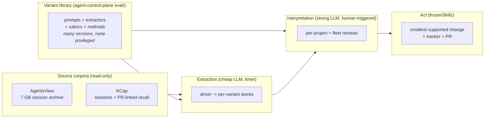

# Evaluation

How frozenSkillz skills and MCP servers are evaluated on an ongoing basis, and how the
pieces fit together. This directory is the router; each document is the authority for
its layer.

| Document | What it answers |
|---|---|
| [architecture.md](architecture.md) | The whole system: surfaces, layers, ownership, data flow |
| [methods-library.md](methods-library.md) | The catalog of evaluation variants — prompts, extractors, rubrics, methods |
| [comparison.md](comparison.md) | How running multiple variants over the same slice earns trust |
| [runbook.md](runbook.md) | How to actually run an extraction, a review, a comparison, a calibration |
| [requirements.md](requirements.md) | Every requirement the system serves, traced to the layer that satisfies it |
| [history.md](history.md) | How we got here: the five-layer loop, the retired reviewer, the empty store |

## The one-minute version

## The number-one principle

**Persist everything; run multiples; never collapse to one approach.**

There is no single "the prompt," "the extractor," or "the method." The library of
variants is the asset. A variant is never deleted for losing a comparison — its losing
record is evidence. Convergence is the failure mode; comparison is how trust is earned.

## The hard boundary

Extraction runs on a timer. Judgment does not. A scheduled job may extract observable
signals into derived stores; it may never grade a session, rewrite a skill, or close a
review item. Review cycles are kicked off by automation but decided by humans. See
[`../workflows/skill-evaluation.md`](../workflows/skill-evaluation.md) → **Scheduled
extraction**.
