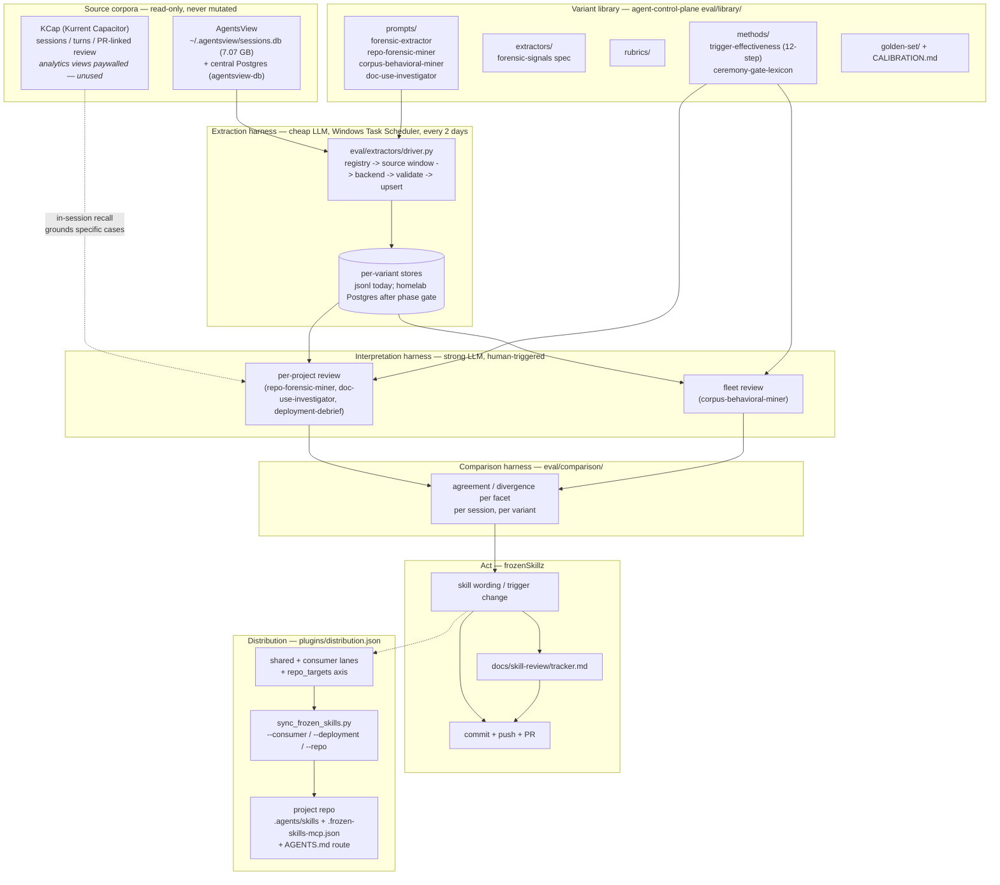
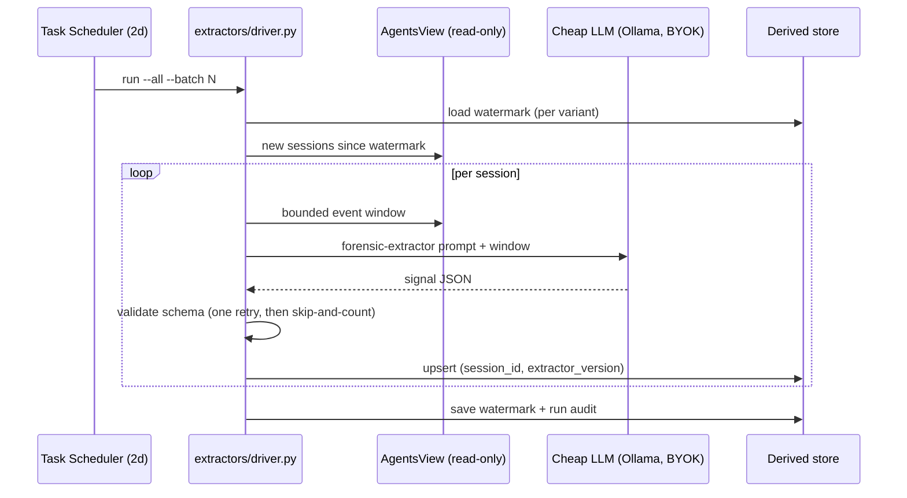

# Evaluation Architecture

The system in one diagram, then the ownership boundaries.

## Ownership

| Surface | Owns | Never does |
|---|---|---|
| AgentsView | Raw cross-harness session corpus (SQLite per machine + central Postgres) | Is never written by this system |
| KCap | Structured sessions/turns, PR-linked transcripts, durable team memory | Analytics SQL is paywalled (403) — not a dependency |
| `agent-control-plane` | The variant library, extractor drivers, comparison harness, run tooling, derived stores | Skill wording decisions |
| homelab Postgres | Per-variant derived stores (`extracted_signals__<variant>`, `extraction_runs`, watermarks) | Disposable — rebuildable from the corpora at any time |
| frozenSkillz (this repo) | Skill text, trigger examples, packaging, lifecycle, tracker, this doc set | Raw transcript storage |

## Layer 1 — extraction

Failure contract: store unreachable → abort before any work, watermark kept; one
session fails → recorded, batch continues; backend down → fast pre-check abort (~1s).

## Layer 2 — interpretation

Human-triggered. A kickoff (Cursor Automation or `codex exec` on Task Scheduler)
assembles a review batch from the derived stores and **stops**. A human then
dispatches reader variants over the batch. Two scales: per-project (friction, rule
application, doc use) and fleet (aggregate clusters, then representative episodes).
The synthesizer reads memos, never raw dumps. Output guardrail on every variant: the
"WHAT SHOULD CHANGE" classification with required evidence — nothing / code / command
/ source-of-truth / retrieval / instruction / skill / delegation / hook / model.

## Act + distribute

A supported finding becomes the smallest change in frozenSkillz: trigger language, a
negative example, body guidance, or a handoff — plus tracker update, commit, PR.
Distribution routes it: `shared` (all consumers), a consumer lane (one client), or
`repo_targets` (only the owning repos, with MCP templates and an AGENTS.md route).
