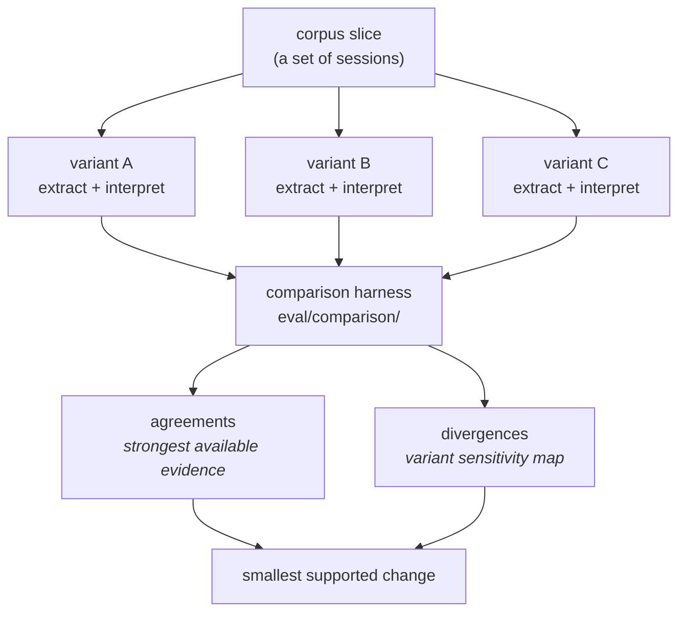

# Comparison

Comparison — not convergence — is how a variant earns trust.

## The idea

Run two or more variants over the same corpus slice and record where they agree and
where they diverge. Agreement across independent variants is the strongest evidence
observational data can give. Divergence is not failure — it localizes where a variant
is sensitive, which is exactly what you need to know before trusting it on a
consequential skill change.



## Mechanics

Extraction variants each write their own store — per-variant tables, never shared
rows. The comparison harness (`eval/comparison/compare.py`) groups signal rows by
session and compares **facets**: loop labels, intervention classes, repeated canonical
commands. A facet is compared only when two or more variants emitted it — no variant's
schema is ever forced onto another.

Output:

- `comparison.jsonl` — per session: variants present, agreeing facets, diverging
  facets with each variant's values.
- `comparison.md` — facet-level agreement/divergence counts across the slice.

For interpretation variants (which produce reports, not signal rows), the same
principle applies manually: run both on the same repo window, keep both reports, and
let the synthesizer or a human read the divergence.

## Rules

1. A variant is never deleted for losing a comparison. Retirement is a `reference`
   marking; the record stays runnable.
2. Every comparison row names the exact variants and versions compared.
3. Divergence on a consequential question is a reason to collect a discriminating
   case, not to average the answers.
4. Comparison results feed the decision rules (keep / narrow / broaden / rewrite /
   disable / insufficient evidence) — they never become an automatic action.

## Example

```powershell
python -m eval.comparison.compare --stores eval/out --out eval/out/comparison
```

Two extractors over the same 50 sessions: one labels a cluster `loop`, the other
`iteration` because it fingerprints results differently. The divergence record shows
both values per session — evidence that the loop taxonomy's result-fingerprint rule is
the sensitive surface, which is where the next calibration case goes.
