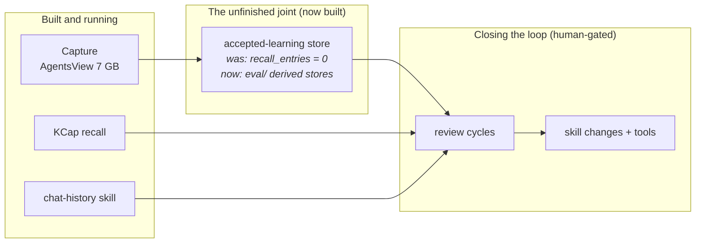

# Evaluation History

How the recurring-evaluator design got to this shape. Everything here is grounded in
the repo record and the Letta transcript corpus (28 transcripts mined 2026-08-15).

## The five-layer loop (the stated target architecture)

Stated in `agent-2a50ea69/default` (2026-08-08):

```text
Capture (AgentsView raw archive)
  -> Structured knowledge (mechanical facts + interpretive conclusions + provenance)
  -> Global cross-project memory (NOT per-repo burial)
  -> Feed lessons back into behavior (PR hygiene, corrections, skill edits)
  -> Promote repeated lessons into tools
```

The corpus was real: 8,088 sessions / 461k messages / 12 harnesses at the time
(8,140+ by 2026-08-10). But the middle layer was never populated — verbatim from the
transcripts: AgentsView `recall_entries` = 0, `insights` = 0. The accepted-learning
store is the unfinished joint. This system's per-variant derived stores complete it.



## The retired Session Reviewer (2026-07-31 → 2026-08-03)

A Letta Cloud agent (`agent-eca49835…`) on cron `nightly-session-review` (08:00 UTC,
device hephastus), driven by `tools/session-review/wake-prompt.md`: condense AgentsView
trajectories, grade against a rubric, write JSON verdicts via `record_verdict.py`,
commit to a review branch. Calibrated against three golden sessions through rubric
v1–v3 (v2 added `pushback` after mid-session owner blowups were invisible; v3 added
`implementation_quality`, `aftermath`, `claims_gap`). v4 (behavior-first primacy) was
never calibrated. Decommissioned 2026-08-03 — agent, cron, and launcher deleted — with
the explicit successor note: intended, but **not that shape**. Rubric material survives
on unmerged branches `review/nightly-grades` and `salvage/skill-tracker-streamline`.

What it teaches this system:

- Calibration discipline is real (v1–v3 earned trust; v4 didn't).
- An agent in the write path grading nightly without a human is the failure mode the
  extraction/judgment boundary exists to prevent.
- Never treat the owner's closing silence as a verdict.

## The 12-step method (2026-08-10)

KCap session `019feb27243a77b08d3b12f187b0eb77` ("Inspect skill routing triggers and
dependencies") worked out the trigger-effectiveness method end to end — activation
ledger, missing-opportunity denominator, decision rules, regression discipline, and
"never let the scheduled process automatically rewrite, promote, or delete skills."
It lived only in a transcript until persisted as
`eval/library/methods/trigger-effectiveness/v1.md`. Its named pilots: `project-docs`
(overtriggering), PDM→Doppler (dependency chaining), `context7-mcp`
(load-without-use), `chat-history` (complex workflow).

## The ceremony metric (2026-07-28)

The gate-lexicon rate (% of interactive sessions offering process ceremony) showed
harness scaffolding dominates model: 27.5% Codex CLI vs 70.6% OpenCode vs 65.2% Kilo
for the same model family. Lesson baked into the fleet miner: attribute clusters by
harness concentration before blaming a skill.

## The practitioner method (2026-08-15)

`NEWINGESTHTHIS/Promps for reasinng over agents.txt` brought the extraction-first
discipline: pull observable mechanics from the raw trace deterministically (repeated
semantic commands, failure fingerprints, reread heat, edit oscillation, correction
windows), then let a strong model explain the structured timeline — never free-form
"analyze performance." Plus RULE MISSING vs RULE PRESENT BUT NOT APPLIED, and the
anti-accretion guardrail ("WHAT SHOULD CHANGE" with required evidence, so the answer
isn't always "another AGENTS.md rule").

## Policy change (2026-08-15)

`docs/workflows/skill-evaluation.md` previously forbade scheduling a monitor. The
2026-08-15 revision splits the boundary: **extraction may run on a timer** (mechanical,
idempotent, writes only to derived stores); **judgment may not** (no auto-grading,
no auto-acting on skills). The retired reviewer violated the second half; this system
keeps the first half cheap and the second half human.
