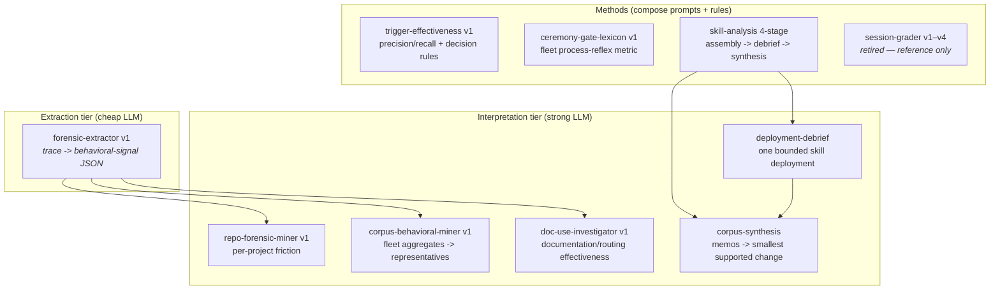
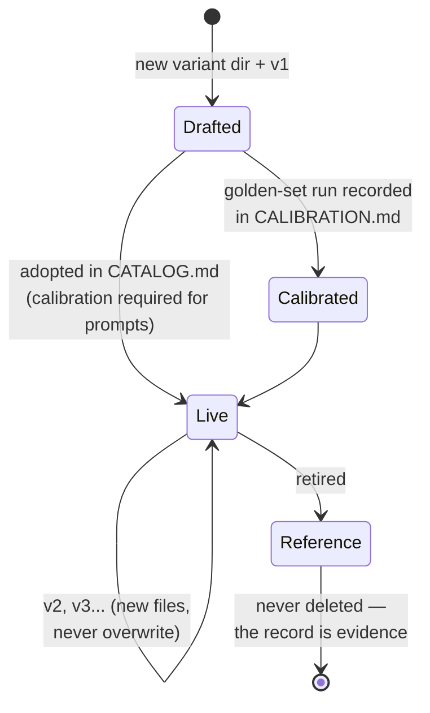

# Methods Library

The catalog of evaluation variants. Each entry: what it is, what question it answers,
where its canonical text lives, and its calibration status. The live, runnable version
of this catalog with version pins is `eval/library/CATALOG.md` in
`agent-control-plane`; this document is the reviewed explanation.

## Why a library, not a method

No single prompt sees everything. A friction miner finds loops; a trigger-effectiveness
method measures precision/recall; a documentation investigator answers routing
questions; a deployment debrief scopes to one skill version. Running several over the
same slice and recording agreement/divergence is stronger evidence than any one of
them — and a variant that loses is kept, because the losing record is evidence.

## The variants

### forensic-extractor (extraction, cheap tier) — v1, uncalibrated

`eval/library/prompts/forensic-extractor/v1.md`. Reads one bounded session event
stream and emits strict JSON: canonicalized repeated commands, failure-signature
fingerprints, file reread/edit heatmap, edit oscillations, user interventions
(classified), subagent duplication, instruction encounters, and a loop taxonomy
(`loop` / `iteration` / `hypothesis_search` / `healthy_investigation`). Extracts; never
judges. Abstains (`unknown`, empty lists) rather than inventing.

Derived from practitioner tooling patterns (Squawk-style cross-event detectors,
Agent Flow's reread signal, Slagent's user-intervention capture) and the 413K-run
empirical result that early repeated identical commands correlate with failure.

### repo-forensic-miner (interpretation, per-project) — v1, uncalibrated

`eval/library/prompts/repo-forensic-miner/v1.md`. Explains extracted signals for one
repository. Required analyses: user-correction episodes (10–20 event lookback),
RULE MISSING vs RULE PRESENT BUT NOT APPLIED, repeated commands/failures, heatmaps,
oscillations, instruction-encounter timing, manually reconstructed workflows, and
source-of-truth collisions ("which files look authoritative enough to cause premature
stopping"). Evidence labels: Observed / Association / Hypothesis / Unknown.

### corpus-behavioral-miner (interpretation, fleet) — v1, uncalibrated

`eval/library/prompts/corpus-behavioral-miner/v1.md`. Aggregates first (correction
classes, loop clusters, delegation, navigation — always with denominators), then
close-reads 2–5 representative episodes per cluster. Attributes global vs repo-local,
and harness-concentrated (scaffolding) vs evenly spread (model or skill).

### doc-use-investigator (interpretation, per-project) — v1, uncalibrated

`eval/library/prompts/doc-use-investigator/v1.md`. Adapted from the trace-corpora
documentation prompt. Discovery / timing / use / failure modes / value / authority
boundary / change candidates, with the four information classes (durable authority,
current work, live state, harness/task state), six failure patterns, and a 13-section
evidence-indexed report. Never recommends a new document unless traces show a specific
discovery or authority failure the smallest existing surface cannot fix.

### skill-analysis 4-stage (method; pointer to frozenSkillz)

`_incubator/personal-skills/skill-analysis/`. corpus-assembly → deployment-debrief →
synthesis-and-interpretation. The only variant with **activation-time skill-version
scoping** (never judge a historical trace against today's skill text) — keep that
property when composing it with others.

### trigger-effectiveness (method) — v1

`eval/library/methods/trigger-effectiveness/v1.md`. Distilled from KCap session
`019feb27243a77b08d3b12f187b0eb77` (2026-08-10). Twelve steps: resolve skill+version →
normalized activation ledger → missing-opportunity denominator (TP/TN/FP/FN) →
per-skill behavioral assertions → bounded representative sample → controlled
comparisons (only when causal, separately authorized) → multi-evidence grading →
provisional decision rules (keep / narrow / broaden / rewrite / remove dependency /
disable / insufficient evidence) → regression per defect → measure in real post-change
use → correct storage split → recurring operation is a review queue, never auto-acting.

### ceremony-gate-lexicon (method) — v1, exercised 2026-07-28

`eval/library/methods/ceremony-gate-lexicon/v1.md`. Gate-lexicon rate = % of
interactive sessions whose assistant text offers process ceremony. Found harness
scaffolding dominates model (27.5% Codex CLI vs 70.6% OpenCode). A metric + review
input, never an automatic action.

### session-grader v1–v4 (retired — reference only)

`tools/session-review/`. The nightly Letta grader, decommissioned 2026-08-03.
Preserved for its rubric evolution (v2 `pushback`; v3 `implementation_quality`,
`aftermath`, `claims_gap`; v4 behavior-first) and its calibration discipline lesson:
v1–v3 calibrated against golden sessions; **v4 shipped uncalibrated**. Its shape —
agent in the write path, grades without a human — is the anti-blueprint this system's
extraction/judgment boundary exists to prevent. See [history.md](history.md).

## Variant lifecycle

## Rubrics

- **Intake scoring** (external candidates): 1–5 per dimension with recommendation
  bands — canonical text in `plugins/frozen-skills/skills/external-skill-intake/references/artifact-rubrics.md`.
- **Ongoing evaluation**: deliberately not numeric. Findings land as the smallest
  supported change or an explicit "no change yet" recorded in the tracker.

## Calibration

No prompt version is adopted without a recorded golden-set run in
`eval/library/CALIBRATION.md`. The golden set draws on already-labeled sessions
(the retired grader's three golden sessions, correction-rich sessions, one clean-run
negative control) and stores IDs + expected labels, never raw transcripts.
