# Diagram / Flowchart Activity Inventory

**Source transcript:** `C:\Users\pmacl\.codex\sessions\2026\08\26\rollout-2026-08-26T11-08-50-01a03ed4-d36a-7333-9548-7b7d8fc6ee32.jsonl` (8,562 lines, 516 `message` records, 775 `custom_tool_call`/`custom_tool_call_output` pairs, ~31.5 MB)

**Method:** The file was parsed line-by-line in Python. Every `message` (role user/assistant/developer), `custom_tool_call`, `custom_tool_call_output`, `function_call`, and `function_call_output` record was extracted with its original line number and timestamp, then searched for: `flowchart`, `flow chart`, `mermaid`, `diagram`, `graph TD`, `graph LR`, `flowchart LR`, `flowchart TD`, `sequenceDiagram`, `pseudocode`, `visual`, `chart`, `color coding`, `styled`. 117 raw keyword hits were found across the transcript; each was individually opened in full context (not just the matching line) to determine whether it was substantive (an actual user request, an actual diagram, a capability statement) or boilerplate (skill-catalog listings, environment-context blocks, recommended-plugin lists, or a Notion "how to format Markdown" syntax reference that happens to show a mermaid code-fence example). Line numbers below (`L####`) refer to line numbers in the source `.jsonl` file.

**Note on `type:"compacted"` records:** 10 compaction events exist in this transcript (lines 518, 1136, 1904, 2385, 3720, 4906, 5289, 5711, 6703, 7765). In every case the human-readable `message` field of the compaction payload is an **empty string**; the only summary content is inside a `compaction` item whose `encrypted_content` field is Fernet-encrypted ciphertext that cannot be read from the transcript. Each compaction's `replacement_history` array was checked and found to contain **verbatim copies** of `message` records that also exist at their own original position earlier in the file (confirmed by exact-string search), so no diagram content unique to a compaction record was found or is missing from this inventory. Nothing quoted below is sourced from a compaction record.

**Overall session shape:** The session opens 2026-08-26 16:08 UTC with the user's task-setting message: *"Grab from Make a plan to use existing runbooks like SSH and the blood arrow. Figure out how to set up the image, then go ahead and test and run our usual benchmarking suite. There's a lot of inconsistency between what's in Notion and what's in the blood arrow. You should probably mostly pay attention to what's in Notion. SSH into the blood arrow, then test out this combination, confirm you can get these numbers, and then write the post-mortem report. Do it with subagent delegation for the most part, for implementation. \n\nhttps://github.com/jpezzulli/qwen38-dflash2-pro6000"* — benchmarking a Qwen model on a physical host called "Blood Arrow" via Vast.ai, with Notion as the documentation system of record. All diagram/flowchart activity found in the transcript relates to this same underlying project (image/registry/cold-start architecture for serving models on Blood Arrow), spanning timestamps from 2026-08-26T16:08 through 2026-08-29T05:00, with a large elapsed-time gap between 2026-08-26T19:15 and 2026-08-28T04:44 (the user returning to the session roughly a day and a half later) and a further ~11.5-hour gap between 2026-08-28T10:01 and 2026-08-28T21:35.

A dedicated per-session visualization directory referenced in `<environment_context>` blocks, `C:\Users\pmacl\.codex\visualizations\2026\08\26\01a03ed4-d36a-7333-9548-7b7d8fc6ee32\`, was checked on disk and **exists but is empty** — no rendered image/HTML artifact was ever written there.

---

## Episode 0 — Pre-existing diagrams encountered/edited in Notion (not user-requested; 2026-08-26T16:10–17:24)

These are diagrams the assistant *found already present* in Notion documentation while doing autonomous documentation reading/updating at the start of the session (in response to the general task-setting message, not a diagram-specific request). They predate this session's authorship.

1. **L78 — 2026-08-26T16:10:14.324Z — `custom_tool_call_output`.** A fetch of the Notion page **"🧠 Local AI Infrastructure"** (page id `3c8c4d26-1ef8-81de-8396-fb44f69b32b4`) returns a pre-existing diagram under the heading "How the system hangs together":
   ```mermaid
   flowchart TD
       I["🧠 Local AI Infrastructure<br>cross-system map and routing"]:::hub
       L["🧰 LLM Rig<br>concise domain hub"]:::hub
       B["🖥️ Bloodarrow<br>planned routing via Local AI<br>live Notion page not yet established"]:::planned
       R["🌐 Remote Model Serving<br>planned routing via Local AI<br>live Notion page not yet established"]:::planned
       M["🎯 Mission + Operating Contract<br>what model work normally means"]:::policy
       W["🔁 Model Bring-up + Optimization<br>artifact → recipe → measure → tune"]:::policy
       S["📏 Benchmark Standards<br>AIPerf profil...
   ```
   (Output was truncated by the harness itself before the full node/edge list could be captured; this is a **read**, not something authored this session.) No user message asked for this; it surfaced as part of autonomous "read Notion authority" exploration.

2. **L86 — 2026-08-26T16:10:23.109Z — `custom_tool_call_output`.** A fetch of Notion page **"🎯 Mission and Operating Contract"** (page id `3c8c4d26-1ef8-8182-b392-ecc01e6f2bfb`) returns a pre-existing diagram under "Required reasoning architecture":
   ```mermaid
   flowchart TD
       F["Machine-derived facts<br>artifact metadata · model config · runtime capabilities<br>hardware state · effective allocation · benchmark outputs"]:::facts
       R["Agent reasoning<br>select and justify artifact · recipe · workload<br>capacity model · first candidate · next optimization"]:::reason
       C["Independent challenge<br>attack transfer assumptions · missing candidates<br>wrong architecture · weak workload semantics"]:::challenge
       D["Deterministic checks<br>reject inconsistency · unsupported settings<br>unsafe capacity · missing files"]:::checks
       ...
   ```
   This same diagram was **re-fetched, unchanged, twice more** later in the session (L2194 at 05:12:35 and L5396 at 21:36:42) as a documentation reference — it was read, not re-authored, each time.

3. **L383 — 2026-08-26T17:24:27.056Z — `custom_tool_call` (`exec`, calling `mcp__codex_apps__notion_notion_update_page`).** As part of "implementing the corrected plan" (documentation-authority pass, triggered by the user's earlier "Implement the proposed plan." at L304, not a diagram request), the assistant edited the **"📏 Benchmark Standards"** Notion page (page id `3c8c4d26-1ef8-81cc-b6e9-f40614344a64`), which already contained a pre-existing AIPerf benchmarking-loop diagram titled "Standardized baseline loop." The edit changed the diagram's decision-gate behavior via an `old_str`/`new_str` replace:
   - **Old** (`flowchart LR`): `L["Load at intended context"]:::run --> I["Real endpoint inference"]:::run` → `B` → `V` → `C` → a gate `H{"Useful headroom or a clear bottleneck?"}:::gate` with `H -- Yes --> A["One informed adjustment"]:::reason` looping `A --> B`, and `H -- No --> P["Persist characterized recipe"]:::output`.
   - **New**: the same `L → I → B → V → C` chain, but `C` now goes straight to `C --> P["Persist measurements and characterized recipe"]:::output` by default, with optimization now only reachable via a dotted, explicitly conditional edge: `C -. "only when optimization is explicitly requested" .-> A["Optimize toward named target"]:::reason` and `A -.-> B`.
   - This edit removed the diagram's implicit "always try to optimize" loop and replaced it with "persist by default, optimize only if explicitly requested," alongside matching prose edits ("What did the measurement reveal?" replacing "What focused improvement does the measured headroom permit?").
   - The post-edit diagram was independently confirmed present by a later read of the same page at **L1014 (17:43:03.771Z)**, returning the new version verbatim.
   - No user message requested this edit; it was done as part of a broader "documentation authority" correction pass the assistant initiated on its own after "Implement the proposed plan."

---

## Episode 1 — "Cold-start appliance lifecycle" flowchart cluster
**Span: 2026-08-28T04:51:57.852Z (L1946) → 2026-08-28T05:42:30.625Z (L2451). 9 distinct Mermaid diagrams produced across the episode.**

### Lead-in
Immediately before this episode, the user had asked "remind me, what were in the middle of benchmarking?" (L1853) and then "can you tell me, how do we get images on the vast.ai host? can't we just transfer locally? I just feel like we don't have to block all the storage space like we do now" (L1892). The assistant answered with a description of a local SSH-tunneled registry push (L1940).

### 1.1 — L1946 (2026-08-28T04:51:57.852Z) — **user, diagram request**
> "diagram the full thing thourgh, remember we'll have to remember not to leave artifacts sitting on the VM, but right, we should be able to just local transfer? question, will we save the running container image to prevent the need to compile every time? or is that not possible"

**Assistant response — L1951 (04:52:06.607Z):** "I'm going to map the complete lifecycle—build, local transfer, registry persistence, owner container, weights/cache, benchmarking, and cleanup. I'll also separate 'save the compiled image' from 'snapshot a running container,' because only the first is the reliable reusable release mechanism here. I'm using the current Vast documentation and our Blood Arrow runbook so the diagram reflects the supported path."

**Diagram 1 — "Full lifecycle" (L2456, `flowchart TD`, inside the L1982 message at 04:53:21.819Z):**
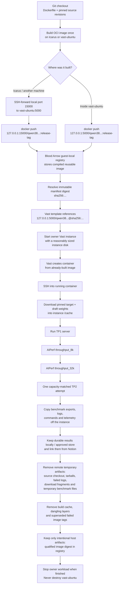
No user reply immediately followed — the same assistant turn continued with a second diagram in response to the "will we save the running container image" half of the same question.

**Diagram 2 — "Troubleshooting loop" (`flowchart LR`, same L1982 assistant turn):**
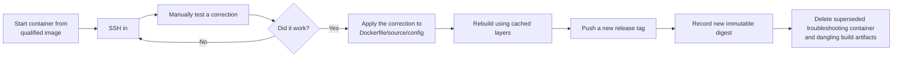

### 1.2 — L1988 (04:53:23.680Z) — user follow-up
> "okay, and what's the downsides there, like how can we clean up?"

**Diagram 3 — "Where space accumulates" (`flowchart TD`, inside L2013 assistant message, 04:54:28.670Z):**
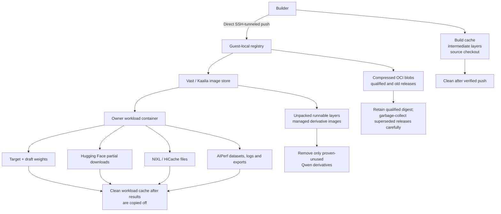

### 1.3 — L2019 (04:54:30.243Z) — user, scope change
> "again we don't need to do the regular approach, I want to save time and expose storage space... and we sometiems have a long compile time, like when we serve deepseek. I really want to see if we can cold start just find without being on the VM"

**Diagram 4 — "Corrected cold-start design" (`flowchart LR`, inside L2080 assistant message, 04:56:18.004Z):**
```mermaid
flowchart LR
    A["Git source and Dockerfile"] --> B["Build compiled SM120 runtime once"]

    B --> C{"Where compilation happens"}
    C -->|"Icarus or another builder"| D["Push directly to external registry"]
    C -->|"Blood Arrow required for compilation"| E["Build temporarily on Blood Arrow"]
    E --> D
    E --> F["Delete temporary builder image/cache<br/>after remote push is verified"]

    D --> G["Durable image stored off Blood Arrow<br/>GHCR, Icarus registry, or NAS registry"]

    G -->|"Cold-start pull"| H["vast-ubuntu Docker store<br/>temporary runnable image copy"]
    H --> I["Ephemeral Vast owner container"]
    I --> J["Copy target + draft weights<br/>into workload storage"]
    J --> K["Serve and benchmark"]

    K --> L["Copy results off workload"]
    L --> M["Stop server"]
    M --> N["Remove owner workload container"]
    N --> O["Remove its specifically identified<br/>local Qwen image layers"]
    O --> P["Blood Arrow capacity available again"]

    G -->|"Next cold start"| H
```

**Diagram 5 — "Handling DeepSeek's long compilation" (`flowchart TD`, same L2080 message):**
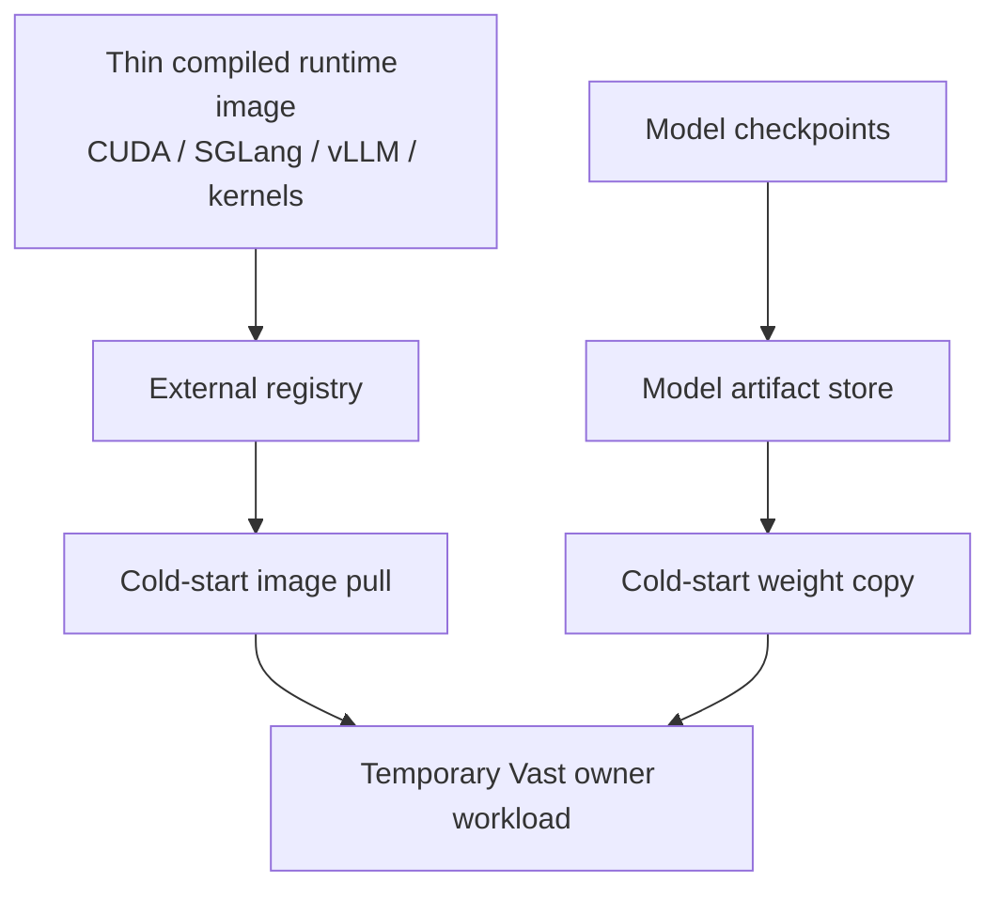

### 1.4 — L2093 (04:56:30.710Z) — user follow-up
> "and why are we oopposed to baking weights, and whatever needs to happen \"graph layers' or whatever? we have plenty of time on the VM, we have a fairly large storage here to store nearby (and fast) etc... what is the oppositino"

(Assistant's L2100/L2110 replies contained no new Mermaid block, only plain-text pipelines and a Markdown table of "what can be baked.")

### 1.5 — L2118 (05:01:24.085Z) — user follow-up
> "does the documentation speculate, overstep, or encode stuff we didn't need?"

Assistant (L2209, 05:13:40.558Z) corrected an earlier over-broad "never touch DeepSeek" statement and produced:

**Diagram 6 — "What all model plans should actually share" (`flowchart TD`):**
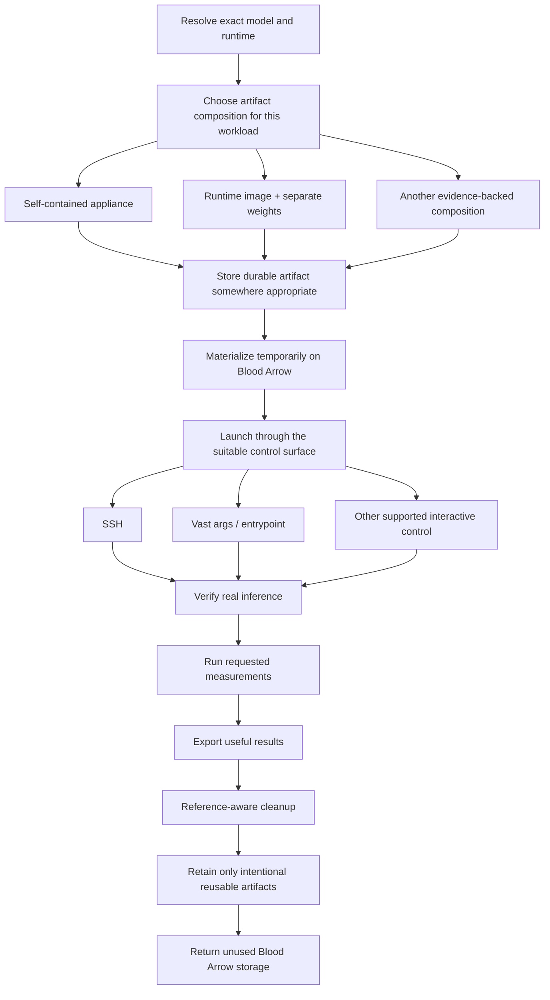

### 1.6 — L2211 (05:13:41.033Z) — user, scope narrowing
> "forget about qwen, we're focusing on the actual thing to do, which is get a reusuable pattern for baskding in and serving from cold start"

**Diagram 7 — "Target pattern" (`flowchart LR`, inside L2218 assistant message, 05:14:12.980Z):**
```mermaid
flowchart LR
    A["Model manifest<br/>weights + runtime revisions"] --> B["Appliance builder"]
    B --> C["Compile runtime and reusable kernels"]
    C --> D["Create bounded OCI layers:<br/>runtime + weights + reusable caches"]
    D --> E["Private registry off Blood Arrow"]

    E -->|"Pull immutable digest"| F["Ephemeral Vast owner workload"]
    F --> G["Runtime-only initialization:<br/>CUDA graph capture + VRAM load"]
    G --> H["Serving endpoint ready"]

    H --> I["Run workload"]
    I --> J["Export logs and measurements"]
    J --> K["Remove workload and local image"]
    K --> L["Verify Blood Arrow storage reclaimed"]

    E -->|"Next cold start; no rebuild"| F
```

### 1.7 — L2228 (05:27:46.991Z) — **user, diagram request (Plan Mode active)**
> "can you call validation to ensure tthat you're not missing anytthing key? can you giver me some flowcharts?"

Assistant (L2233): "I'm using the plan-validation skill to challenge the reusable cold-start appliance plan against the actual tracked work and prior constraints. After that I'll give you the corrected plan with flowcharts for build/publish, cold start, and cleanup/reclamation."

### 1.8 — L2276 (05:29:01.973Z) — user follow-up
> "can you tell me, why is there no machien readbale plan?"

**Assistant capability statement — L2281 (05:29:26.903Z):** "`kcap validate-plan` does not parse arbitrary planning prose, Mermaid diagrams, or assistant messages. It only recognizes: Plan content attached when a session starts or continues, or An in-session plan event captured through the supported planning hooks." (This is a stated *limit of a validation tool*, not of diagram rendering — noted because it explicitly names "Mermaid diagrams.")

### 1.9 — L2283 (05:29:27.434Z) — user, sharp correction
> "and what are you talking about, you should do this on the blood arrow you moron...."

(Assistant acknowledged misreading "off the VM" as "off Blood Arrow" and re-grounded the plan on the physical Blood Arrow host.)

### 1.10 — L2358/L2360 (05:33:26.928Z / 05:33:27.298Z) — user, two-part
> "you need to use one of the specific existing recipies, not guesssing."
> "remember to start writing that plan or you'll forget"

### 1.11 — L2436 (05:39:25.505Z) — assistant, `<proposed_plan>` block containing 2 more diagrams

**Diagram 8 — plan pipeline (`flowchart LR`):**
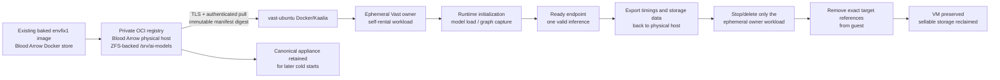

**Diagram 9 — plan sequence diagram (`sequenceDiagram`, same `<proposed_plan>` block):**
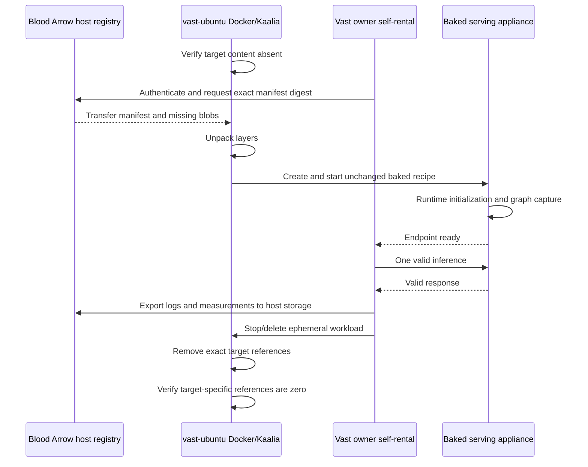

### Episode 1 ends — L2451 (2026-08-28T05:42:30.625Z) — **verbatim ending user message**
> "PLEASE IMPLEMENT THIS PLAN:
> # Blood Arrow Baked-Appliance Cold-Start Proof
> ..." (the user pasted the entire assistant-proposed plan text — identical to the `<proposed_plan>` block quoted above — back to the assistant as an instruction to execute it, switching collaboration mode from Plan Mode to Default/execution mode.)

**Durable-destination status for Episode 1:** none of the 9 diagrams in this episode were written to any file, Notion page, or other durable store during this episode — they exist only as chat message content. (One of them — Diagram 8 — closely foreshadows content that is later, in Episode 3, actually written into Notion; but that write happens in a separate episode roughly 17 hours later.)

---

## Episode 1b — ASCII price-comparison "visual" (not a flowchart)
**Span: 2026-08-28T07:47:33.988Z (L4648) → 2026-08-28T07:50:36.992Z (L4732)**

### L4648 (07:47:33.988Z) — **user, visual request**
> "Right, and what you should also do is, dispatch a subagent, give me a visual of how close I am to cheapest."

Assistant (L4653): "I'm dispatching a read-only market subagent now. I'll compare Blood Arrow's actual two-GPU full-machine interruptible floor with current comparable RTX PRO 6000 offers, keeping the marketplace listing price separate from the owner self-rental minimum, then show where it sits visually." Two more status updates followed (L4670, L4695, L4716) while a subagent gathered live pricing data.

### L4721 (07:50:14.839Z) — user, topic change before the visual was delivered
> "why don't you work on putting the deepseek volumne on?"

The assistant's next message (L4732, 07:50:36.992Z) answered the DeepSeek-volume question *and* delivered the requested visual in the same turn — a plain-text (non-Mermaid) ASCII bar chart, not a flowchart:
```text
RTX PRO 6000 WS · two full GPUs · interruptible minimum per hour

Blood Arrow  $1.0933  ████████████                    #1 / 7
Next lowest  $1.3333  ███████████████                 +18.0%
Median       $1.6000  ██████████████████              +46.3%
Highest      $2.6667  ██████████████████████████████
```
No further user comment on this chart was found; the conversation moved on to other Blood Arrow/Vast operational work. Not written to any durable store — chat-only.

---

## Episode 2 — "Color-coded reconstruction / pseudocode" flowchart cluster
**Span: 2026-08-28T09:25:49.432Z (L4983) → 2026-08-28T10:01:54.456Z (L5336). 8 distinct Mermaid diagrams produced.**

### 2.1 — L4983 (09:25:49.432Z) — **user, flowchart + pseudocode request**
> "right so lets just forget anything else. What did yo ulearn from last time, and what dd you mess with around vast? instead of doing anything, I want yo uto make a folder and just make a set of scirpts (but for now, just gie me a flowchart with pseudocode."
(Message as transcribed ends with an unclosed parenthesis — verbatim, including the typos "yo ulearn," "dd you," "yo uto," "scirpts," "gie me.")

Assistant (L4990): "I'll keep this to the reset you asked for: an honest ledger of what happened around Vast, the lessons that matter, and a simple script-driven flow. No infrastructure actions and no attempt to turn the previous configuration into the new recipe."

**Diagram 10 — script-pipeline flowchart (`flowchart TD`, inside L5011 assistant message, 09:27:13.363Z), with matching pseudocode for each script (`00-inspect.sh` through `90-clean-exact-guest-artifacts.sh`) printed immediately after it:**
```mermaid
flowchart TD
    A["00-inspect.sh<br/>Read-only inspection"] --> B{"Correct physical host?<br/>bloodarrow"}
    B -- "No" --> X["STOP<br/>No mutations"]
    B -- "Yes" --> C{"vast-ubuntu exists<br/>and is running?"}
    C -- "No" --> X
    C -- "Yes" --> D["Record current Vast state<br/>listing, offers, contracts,<br/>GPU reservations, volumes"]
    D --> E{"Unrelated active workload<br/>or renter present?"}
    E -- "Yes" --> X
    E -- "No" --> F["Pin Infatoshi repository<br/>to an explicit commit"]
    F --> G["Select upstream script<br/>serve_256k_marlin.sh"]
    G --> H["10-build-appliance.sh<br/>Build on physical Blood Arrow<br/>No Vast and no GPUs"]
    H --> I{"Pinned dependencies installed?<br/>All patches cleanly applied?<br/>Recipe unchanged?"}
    I -- "No" --> X
    I -- "Yes" --> J["Embed checkpoint,<br/>runtime, patches, kernels,<br/>and upstream launch script"]
    J --> K["20-publish-appliance.sh<br/>Push immutable image to<br/>Blood Arrow registry"]
    K --> L{"Registry digest independently<br/>matches published digest?"}
    L -- "No" --> X
    L -- "Yes" --> M["30-launch-owner-workload.sh"]
    M --> N["Refresh Vast state again"]
    N --> O{"Exactly two GPUs free<br/>and supported owner path known?"}
    O -- "No" --> X
    O -- "Yes" --> P["Create one exact two-GPU<br/>owner workload using the<br/>current supported Vast interface"]
    P --> Q["Pull appliance by digest"]
    Q --> R["Start unchanged upstream recipe"]
    R --> S["40-validate-serving.sh"]
    S --> T{"Health endpoint ready?"}
    T -- "No" --> U["Capture exact runtime failure"]
    T -- "Yes" --> V{"Upstream pong test succeeds?"}
    V -- "No" --> U
    V -- "Yes" --> W["Record cold-start stages<br/>and one valid inference"]
    U --> Y["50-stop-owner-workload.sh"]
    W --> Y
    Y --> Z["Delete only the exact<br/>owner workload"]
    Z --> AA["90-clean-exact-guest-artifacts.sh"]
    AA --> AB["Remove only recorded target<br/>containers and image references"]
    AB --> AC{"VM still running?<br/>Docker healthy?<br/>No target references?<br/>Listing restored as intended?"}
    AC -- "No" --> AD["Report concrete cleanup failure<br/>Do not broaden deletion"]
    AC -- "Yes" --> AE["DONE<br/>Host appliance retained;<br/>guest returned clean"]
```
(The full pseudocode block that followed — per-script pseudo-programs for `00-inspect.sh`, `10-build-appliance.sh`, `20-publish-appliance.sh`, `lib/vast-owner.sh`, `30-launch-owner-workload.sh`, `40-validate-serving.sh`, `50-stop-owner-workload.sh`, `90-clean-exact-guest-artifacts.sh` — is roughly 200 lines and is available verbatim in the transcript at L4983's response, not reproduced here in full per the "trim only if it exceeds ~60 lines" instruction for Mermaid; this is plain pseudocode text, not Mermaid.)

### 2.2 — L5017 (09:27:40.363Z) — **user, revision request: color coding**
> "try again i want a flowchart of exactly what you did with color coding green or red or etc.. as appropriate, very rich, aBOUT WHAT YO UDID, and about whether, we want to do the EXACT same thing."

Assistant (L5022): "I'm using the rich-visual response guidance because you want an evidence-oriented, color-coded reconstruction—not another proposed architecture." It then read a skill file (`rich-visual-responses/SKILL.md`) via `exec_command` (custom_tool_call at L5023/L5052/L5195/L5216/L6258, repeated several times through this episode) before producing colored diagrams.

**Diagram 11 — "reconstruction" flowchart with emoji-color legend (🟢 Repeat / 🔵 Reuse / 🟡 Conditional / 🔴 Reject / ⚪ Outcome), `flowchart TD`, 4 subgraphs (Artifact / Guest / Vast / Missing), inside L5038 assistant message (09:29:26.834Z):**
```mermaid
flowchart TD
    Start["🎯 Started cold-start work<br/>Goal: reusable DeepSeek appliance"] -->|"selected existing artifact"| OldImage

    subgraph Artifact["📦 Artifact work on physical Blood Arrow"]
        OldImage["🔴 Existing envfix1 image<br/>Selected as the serving source<br/>WRONG recipe for the new proof"]
        InspectHost["🟢 Inspected Blood Arrow<br/>Docker images, storage, VM,<br/>Vast contracts and GPU state"]
        Registry["🔵 Created host-local OCI registry<br/>192.168.122.1:5001<br/>Data under /srv/ai-models"]
        Archive["🔴 Created/retained ~165 GB archive<br/>of the old envfix1 appliance<br/>Not the Infatoshi recipe"]
        PushOld["🔴 Pushed envfix1 into registry<br/>Verified old manifest digest<br/>Wrong artifact, sound mechanism"]
        RestartRegistry["🟢 Restarted only the host registry<br/>Confirmed manifest survived<br/>VM and guest Docker unaffected"]

        OldImage -->|"before mutation"| InspectHost
        InspectHost -->|"delivery mechanism"| Registry
        Registry -->|"retained old artifact"| Archive
        Archive -->|"published old image"| PushOld
        PushOld -->|"resilience check"| RestartRegistry
    end

    subgraph Guest["🖥️ Changes inside persistent vast-ubuntu VM"]
        GuestCA["🔵 Installed registry CA<br/>Endpoint-specific Docker trust path"]
        ProposedRestart["🔴 Proposed restarting guest Docker<br/>THIS WAS NOT PERFORMED"]
        DaemonUntouched["🟢 Preserved daemon.json<br/>Preserved Kaalia runtime<br/>Guest Docker never restarted"]
        GuestCleanup["🟡 Deleted obsolete guest-local<br/>DeepSeek manifests and blobs<br/>Reclaimed about 432 GiB"]

        RestartRegistry -->|"prepared guest trust"| GuestCA
        GuestCA -.->|"bad proposed next step"| ProposedRestart
        GuestCA -->|"actual path"| DaemonUntouched
        DaemonUntouched -->|"exact-reference cleanup"| GuestCleanup
    end

    subgraph Vast["🌐 Vast control-plane activity"]
        Relist["🟡 Relisted Blood Arrow<br/>Restored captured pricing<br/>Made machine available"]
        NoAccept["⚪ No renter offer accepted<br/>Relisting was not acceptance"]
        Offer["⚪ Observed fresh offer 48981766<br/>Machine rentable; two GPUs"]
        Contract["🟢 Found stopped contract 48722800<br/>Still reserving both GPUs in Kaalia"]
        UserDelete["🟡 You deleted contract 48722800<br/>Exact stale owner contract only"]
        VolumeDelete["🔴 Deleted old Marlin volume 48585695<br/>After explicit authorization<br/>Reclaimed about 336 GiB"]

        GuestCleanup -->|"returned capacity"| Relist
        Relist -->|"market visibility"| NoAccept
        NoAccept -->|"read-only verification"| Offer
        Offer -->|"GPU allocation inspection"| Contract
        Contract -->|"your explicit action"| UserDelete
        UserDelete -->|"separate authorized cleanup"| VolumeDelete
    end

    subgraph Missing["🚫 What never happened"]
        NoOwner["🔴 No new two-GPU<br/>owner workload was created"]
        NoPull["🔴 No image was pulled<br/>into a clean owner workload"]
        NoServe["🔴 DeepSeek never started<br/>No health endpoint"]
        NoInference["🔴 No valid inference<br/>No cold-start measurement"]
        VMSafe["🟢 vast-ubuntu remained running<br/>No reboot, reprovision, or destruction"]

        VolumeDelete -->|"execution stopped here"| NoOwner
        NoOwner -->|"therefore"| NoPull
        NoPull -->|"therefore"| NoServe
        NoServe -->|"therefore"| NoInference
        NoInference -->|"infrastructure outcome"| VMSafe
    end

    classDef repeat fill:#1f6f43,color:#ffffff,stroke:#2ea043,stroke-width:3px
    classDef reuse fill:#164e78,color:#ffffff,stroke:#58a6ff,stroke-width:3px
    classDef conditional fill:#6e5517,color:#ffffff,stroke:#d29922,stroke-width:3px
    classDef reject fill:#7a2626,color:#ffffff,stroke:#f85149,stroke-width:3px
    classDef outcome fill:#3b4148,color:#ffffff,stroke:#8b949e,stroke-width:2px

    class InspectHost,RestartRegistry,DaemonUntouched,Contract,VMSafe repeat
    class Registry,GuestCA reuse
    class GuestCleanup,Relist,UserDelete conditional
    class OldImage,Archive,PushOld,ProposedRestart,VolumeDelete,NoOwner,NoPull,NoServe,NoInference reject
    class NoAccept,Offer outcome
```
This was followed by a colored Markdown table ("Do we repeat each action?") using inline `<span style="color:#…">` for Yes/No/Reuse verdicts.

**Diagram 12 — "The part worth keeping" (`flowchart LR`, same L5038 message):**
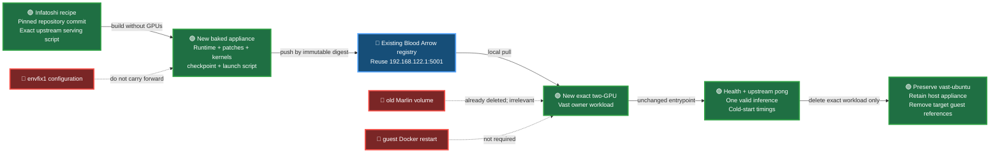

### 2.3 — L5044 (09:29:44.736Z) — **user, revision request: wrong axis of evaluation**
> "again, I don't care if it wsa the wrong artifact, I want to know if it was teh correct action"

Assistant (L5051): "You're right. I answered 'was the selected content correct?' when you asked 'was the operation correct?' I'm reclassifying the sequence strictly by operational correctness..."

**Diagram 13 — "corrected legend" flowchart (🟢 Correct / 🟡 Correct once / 🔴 Incorrect / 🔵 Missing), `flowchart TD`, inside L5061 assistant message (09:31:03.990Z):**
```mermaid
flowchart TD
    Start["🎯 Begin reusable cold-start proof"] -->|"establish live state"| Inspect
    Inspect["🟢 Inspect Blood Arrow and Vast<br/>VM, Docker, GPUs, contracts,<br/>listing, volumes, storage"]
    Inspect -->|"create reusable delivery path"| Registry
    Registry["🟡 Create private registry on Blood Arrow<br/>Correct one-time infrastructure action"]
    Registry -->|"add authentication and TLS"| RegistrySecurity
    RegistrySecurity["🟡 Secure the registry<br/>TLS + authentication<br/>Correct one-time action"]
    RegistrySecurity -->|"retain an extra copy"| Archive
    Archive["🟡 Export OCI archive<br/>Valid backup, but redundant<br/>when registry already retains blobs"]
    Archive -->|"publish appliance"| Push
    Push["🟢 Push image to local registry<br/>Correct reusable operation"]
    Push -->|"independently read manifest"| Digest
    Digest["🟢 Verify immutable manifest digest<br/>Correct and required"]
    Digest -->|"one-time durability test"| RegistryRestart
    RegistryRestart["🟡 Restart host registry only<br/>Verify retained blobs survive<br/>Correct one-time resilience test"]
    RegistryRestart -->|"establish guest trust"| GuestCA
    GuestCA["🟡 Install registry CA in vast-ubuntu<br/>Correct one-time TLS trust action"]
    GuestCA -.->|"I proposed this"| BadRestart
    BadRestart["🔴 Restart guest Docker<br/>Unnecessary and potentially disruptive<br/>NOT ACTUALLY PERFORMED"]
    GuestCA -->|"actual action"| PreserveDocker
    PreserveDocker["🟢 Leave guest Docker running<br/>Preserve daemon.json and Kaalia runtime"]
    PreserveDocker -->|"make cold-state storage real"| GuestCleanup
    GuestCleanup["🟢 Remove exact obsolete manifests<br/>Registry-supported garbage collection<br/>Reclaimed about 432 GiB"]
    GuestCleanup -->|"restore Vast market state"| Relist
    Relist["🟢 Relist Blood Arrow<br/>Correct Vast control-plane action<br/>Did not accept a renter offer"]
    Relist -->|"inspect GPU availability"| ContractCheck
    ContractCheck["🟢 Inspect contracts and Kaalia state<br/>Found stopped contract still<br/>reserving both GPUs"]
    ContractCheck -->|"you removed exact blocker"| ContractDelete
    ContractDelete["🟢 Delete stale contract 48722800<br/>Correct because it exclusively<br/>blocked both required GPUs"]
    ContractDelete -->|"authorized storage cleanup"| VolumeDelete
    VolumeDelete["🟢 Delete unreferenced old Marlin volume<br/>Correct exact-target cleanup<br/>Reclaimed about 336 GiB"]
    VolumeDelete -->|"both GPUs and storage now available"| Ready
    Ready["🟢 Blood Arrow ready for owner launch<br/>vast-ubuntu running<br/>Docker healthy<br/>host registry available"]
    Ready -->|"required next action never executed"| MissingOwner
    MissingOwner["🔵 Create exact two-GPU<br/>Vast owner workload<br/>MISSING"]
    MissingOwner -->|"then pull by digest"| MissingPull
    MissingPull["🔵 Pull appliance from Blood Arrow<br/>MISSING"]
    MissingPull -->|"then start serving"| MissingServe
    MissingServe["🔵 Start model and test inference<br/>MISSING"]

    classDef correct fill:#1f6f43,color:#ffffff,stroke:#2ea043,stroke-width:3px
    classDef once fill:#6e5517,color:#ffffff,stroke:#d29922,stroke-width:3px
    classDef incorrect fill:#7a2626,color:#ffffff,stroke:#f85149,stroke-width:3px
    classDef missing fill:#164e78,color:#ffffff,stroke:#58a6ff,stroke-width:3px

    class Inspect,Push,Digest,PreserveDocker,GuestCleanup,Relist,ContractCheck,ContractDelete,VolumeDelete,Ready correct
    class Registry,RegistrySecurity,Archive,RegistryRestart,GuestCA once
    class BadRestart incorrect
    class MissingOwner,MissingPull,MissingServe missing
```

### 2.4 — L5063 (09:31:04.656Z) — **user, revision request: missing content, cites the recording tool**
> "You're missing us removing the image, are you sure this is what you did? use kcap"

Assistant (L5068): "You're right to challenge it. I omitted an image-removal step, so my reconstruction is not reliable enough. I'm using KCap now to recover the recorded action sequence and will correct the diagram from the session record rather than from the conversation summary." It queried the KCap session-recall tools (L5088/5101/5111/5130/5136/5146) and found a separate recorded session that contradicted its own reconstruction.

**Diagram 14 — "We did this" image-removal detail (`flowchart TD`, inside L5153 assistant message, 09:34:05.145Z):**
```mermaid
flowchart TD
    Host["🟢 Physical-host registry verified<br/>Canonical envfix1 digest retained<br/>OCI archive retained"] -->|"prove replacement exists first"| References
    References["🟢 Reference checks<br/>No container used the three images<br/>No target image in Docker/containerd<br/>Protected Marlin resources unrelated"]
    References -->|"request exact manifest deletion"| FirstDelete
    FirstDelete["🔴 First deletion attempt<br/>Guest registry returned HTTP 405<br/>Deletion disabled"]
    FirstDelete -->|"do not modify Docker daemon"| MaintenanceRegistry
    MaintenanceRegistry["🟡 Stop only local-registry<br/>Start temporary same-image registry<br/>Same exact data volume<br/>Deletion enabled"]
    MaintenanceRegistry -->|"registry API DELETE"| DeleteTags
    DeleteTags["🟢 Delete all three tagged manifests<br/>monolithic + split + envfix1"]
    DeleteTags -->|"find remaining revision links"| DeleteChildren
    DeleteChildren["🟢 Delete untagged child manifests<br/>Remove all target revision links"]
    DeleteChildren -->|"registry stopped"| GC
    GC["🟢 Run registry-supported<br/>garbage collection"]
    GC -->|"restore normal service"| Restore
    Restore["🟢 Restore original local-registry<br/>Original restart policy preserved<br/>Guest Docker never restarted"]
    Restore -->|"verify final state"| Result
    Result["🟢 Target tag returns 404<br/>Zero target revision links<br/>463,730,998,119 bytes reclaimed<br/>about 431.9 GiB"]

    classDef correct fill:#1f6f43,color:#ffffff,stroke:#2ea043,stroke-width:3px
    classDef maintenance fill:#6e5517,color:#ffffff,stroke:#d29922,stroke-width:3px
    classDef failed fill:#7a2626,color:#ffffff,stroke:#f85149,stroke-width:3px

    class Host,References,DeleteTags,DeleteChildren,GC,Restore,Result correct
    class MaintenanceRegistry maintenance
    class FirstDelete failed
```

**Diagram 15 — "Exact corrected sequence" (`flowchart TD`, same L5153 message):**
```mermaid
flowchart TD
    A["🟢 Inspect Blood Arrow<br/>VM, Vast state, storage,<br/>registry and GPU allocation"]
    B["🟢 Seal OCI archive<br/>Verify index, manifest,<br/>config and attestation"]
    C["🟢 Push appliance to<br/>physical-host registry"]
    D["🟢 Verify digest<br/>Restart-test host registry only"]
    E["🟢 Install registry CA<br/>No daemon.json change<br/>No Docker restart"]
    F["🟢 REMOVE GUEST-LOCAL IMAGE COPIES<br/>Three tags + child manifests + GC<br/>Reclaim about 431.9 GiB"]
    G["🟢 Relist Blood Arrow<br/>Discover fresh offer 48981766"]
    H["🔴 Owner launch attempts blocked<br/>Stopped contract 48722800<br/>still reserved both GPUs"]
    I["🟢 You removed stale contract 48722800<br/>Kaalia GPU reservation cleared"]
    J["🟢 Delete orphaned Docker volume V.48585695<br/>After exact reference checks<br/>Reclaim about 336.16 GiB"]
    K["🔵 Required owner workload<br/>NEVER CREATED"]
    L["🔵 No pull, startup,<br/>inference, or cold-start timing"]

    A -->|"establish safe state"| B
    B -->|"publish retained source"| C
    C -->|"prove durable source"| D
    D -->|"allow secure guest pull"| E
    E -->|"remove old in-VM duplicate"| F
    F -->|"make machine rentable"| G
    G -->|"attempt self-rental"| H
    H -->|"manual exact blocker removal"| I
    I -->|"separate authorized cleanup"| J
    J -->|"execution should have continued"| K
    K -->|"therefore"| L

    classDef correct fill:#1f6f43,color:#ffffff,stroke:#2ea043,stroke-width:3px
    classDef failed fill:#7a2626,color:#ffffff,stroke:#f85149,stroke-width:3px
    classDef missing fill:#164e78,color:#ffffff,stroke:#58a6ff,stroke-width:3px

    class A,B,C,D,E,F,G,I,J correct
    class H failed
    class K,L missing
```

### 2.5 — L5159 (09:39:44.638Z) — **user, capability question**
> "so are you limited to just basic flowchartrs when you make them pretty?"

**Assistant capability statement — L5164 (09:39:53.711Z):** "No. Mermaid flowcharts are only the quickest inline option. I'm checking the current Codex visualization surfaces so I can distinguish what I can render directly in chat from what I can build as a richer interactive or designed artifact." It ran a web search (`custom_tool_call` at L5171: `site:developers.openai.com Codex app visualizations diagrams Mermaid`).

**Assistant capability statement, expanded — L5178 (09:40:32.144Z):** "No. The basic Mermaid diagrams were a convenience choice, not a capability limit. I underdelivered on 'very rich.'" It listed a table of formats it says it can produce:

| Format | Best for | Capabilities |
|---|---|---|
| Styled Mermaid | Fast inline explanation | Swimlanes, subgraphs, sequence diagrams, state machines, color-coded paths, annotations |
| Rendered SVG/PNG | Polished static deliverable | Custom typography, icons, legends, spatial grouping, storage bars, timelines, callouts |
| Interactive HTML visualization | Complex operational history | Zoom/pan, hover evidence, expandable nodes, filters, toggles, animation, linked timelines |
| Dashboard-style artifact | Comparing actual versus intended behavior | Status cards, storage deltas, event chronology, resource state, success/failure paths |
| Figma/FigJam diagram | Collaborative editing and presentation | Designed components, reusable styles, connectors, comments, presentation-ready layout |
| Generated infographic | Narrative overview | Illustrated architecture or process map, though less suitable for exact technical evidence |

It then sketched (as plain ASCII text, not rendered) what an "interactive forensic operations map" mock-up might look like, with swimlanes for PHYSICAL HOST / VAST-UBUNTU / VAST CONTROL PLANE / OWNER ACTIONS / STORAGE / RESULT, and closed with: "Codex is capable of building full data visualizations and visual applications, not merely emitting Mermaid... So: **no, I'm not limited to basic flowcharts. I selected the weakest format for a history that needed a timeline, swimlanes, evidence expansion, and actual-versus-repeat comparison.**" None of the richer formats (SVG/PNG, interactive HTML, Figma/FigJam) were actually invoked anywhere in this transcript — no `generate_diagram` (Figma) tool call, no SVG/PNG file, no HTML artifact was found.

### 2.6 — L5187 (09:42:29.098Z) — **user, diagram request repeated with dissatisfaction**
> "okay, lets try a just a styled mermaid, with pseudocode steps, because you haven't gotten it right yet"

This is the clearest instance in the transcript of the user asking for **effectively the same diagram again** after having already received several — explicitly stating dissatisfaction ("you haven't gotten it right yet") rather than asking for new content.

Assistant (L5194): "I'll make this one evidence-first: the diagram will show the actual KCap-recorded sequence, including the full guest image removal, the two failed operational branches, the later contract and volume deletions, and the point where execution stopped. The pseudocode will map one-to-one to the numbered diagram nodes."

**Diagram 16 — numbered ①–⑳ flowchart with 4 subgraphs (HOST / GUEST / VAST / LATER / MISSING), `flowchart TB`, inside L5204 assistant message (09:44:14.476Z), with one-to-one matching pseudocode immediately following (reproduced in full below since both together approach ~150 lines but the diagram itself is under 60):**
```mermaid
flowchart TB
    subgraph HOST["🖥️ PHYSICAL BLOOD ARROW — retained appliance source"]
        direction LR
        S01["① 🟢 Preflight<br/>VM running<br/>No renters<br/>GPUs and storage inspected"]
        S02["② 🟡 Seal OCI archive<br/>Verify index, manifest,<br/>config and attestation"]
        S03["③ 🟢 Publish to host registry<br/>Native Docker push<br/>Preserve OCI index"]
        S04["④ 🟡 Verify durable registry<br/>Read digest back<br/>Restart host registry only<br/>Read same digest again"]
        S01 -->|"live state safe"| S02
        S02 -->|"archive verified"| S03
        S03 -->|"exact digest published"| S04
    end
    subgraph GUEST["📦 VAST-UBUNTU GUEST — remove old in-VM image copy"]
        direction LR
        S05["⑤ 🟡 Install registry CA<br/>Endpoint certs.d only<br/>No daemon.json change<br/>No Docker restart"]
        S06["⑥ 🟢 Reference check<br/>No target containers<br/>No target Docker image<br/>No target containerd image"]
        S07["⑦ 🔴 First registry deletion<br/>HTTP 405<br/>Deletion disabled"]
        S08["⑧ 🟢 Exact image removal<br/>Stop only local-registry<br/>Temporary deletion-enabled registry<br/>Same registry data volume"]
        S09["⑨ 🟢 Delete complete image set<br/>monolithic tag<br/>split tag<br/>envfix1 tag<br/>all child manifests"]
        S10["⑩ 🟢 Supported registry GC<br/>Restore original local-registry<br/>Target tags return 404<br/>Zero target revision links"]
        Reclaim["⚫ Reclaimed<br/>463,730,998,119 bytes<br/>≈ 431.9 GiB"]
        S05 -->|"trust installed"| S06
        S06 -->|"safe to remove exact images"| S07
        S07 -->|"retry using verified maintenance path"| S08
        S08 -->|"registry API deletion"| S09
        S09 -->|"remove now-unreferenced blobs"| S10
        S10 -->|"measured result"| Reclaim
    end
    subgraph VAST["🌐 VAST CONTROL PLANE — launch attempts"]
        direction LR
        S11["⑪ 🔴 Launch while unlisted<br/>Historical offer retired<br/>HTTP 400<br/>No contract created<br/>No image pulled"]
        S12["⑫ 🟢 Relist machine 147734<br/>Restore captured terms<br/>Discover offer 48981766"]
        S13["⑬ 🔴 Launch from fresh offer<br/>GPU-conflict response<br/>Stopped contract 48722800<br/>still reserved both GPUs"]
        S11 -->|"supported path requires live offer"| S12
        S12 -->|"fresh two-GPU offer"| S13
    end
    subgraph LATER["🧹 LATER EXACT CLEANUP — current session"]
        direction LR
        S14["⑭ 🟡 You delete contract 48722800<br/>Kaalia GPU reservation clears<br/>No GPU compute remains"]
        S15["⑮ 🟡 Delete orphaned volume V.48585695<br/>No container, process, mount,<br/>or Vast reference"]
        VolumeResult["⚫ Reclaimed<br/>360,953,810,944 bytes<br/>≈ 336.16 GiB"]
        S14 -->|"volume becomes orphaned"| S15
        S15 -->|"measured result"| VolumeResult
    end
    subgraph MISSING["🚫 REQUIRED COLD-START PROOF — NEVER EXECUTED"]
        direction LR
        M01["⑯ 🔵 Create new<br/>two-GPU owner workload"]
        M02["⑰ 🔵 Pull image from<br/>physical-host registry"]
        M03["⑱ 🔵 Unpack and start<br/>Infatoshi serving recipe"]
        M04["⑲ 🔵 Reach health<br/>Run valid inference"]
        M05["⑳ 🔵 Remove exact pulled image<br/>and owner workload<br/>Then repeat cold start"]
        M01 -->|"Kaalia pull"| M02
        M02 -->|"local transfer"| M03
        M03 -->|"runtime initialization"| M04
        M04 -->|"exact cleanup"| M05
    end
    S04 -->|"host appliance retained"| S05
    Reclaim -->|"guest duplicate removed"| S11
    S13 -->|"owner manually clears blocker"| S14
    VolumeResult -->|"system ready, but execution stopped"| M01
    Final["⚫ ACTUAL FINAL STATE<br/>Host appliance retained<br/>Guest image copies removed<br/>Old volume removed<br/>vast-ubuntu healthy<br/>No cold-start workload ever launched"]
    M01 -.->|"not reached"| Final

    classDef correct fill:#173f2b,color:#ffffff,stroke:#2ea043,stroke-width:3px
    classDef once fill:#594611,color:#ffffff,stroke:#d29922,stroke-width:3px
    classDef failed fill:#642323,color:#ffffff,stroke:#f85149,stroke-width:3px
    classDef missing fill:#123e62,color:#ffffff,stroke:#58a6ff,stroke-width:3px
    classDef state fill:#30363d,color:#ffffff,stroke:#8b949e,stroke-width:2px

    class S01,S03,S06,S08,S09,S10,S12 correct
    class S02,S04,S05,S14,S15 once
    class S07,S11,S13 failed
    class M01,M02,M03,M04,M05 missing
    class Reclaim,VolumeResult,Final state
```
Matching pseudocode block (numbered comments ① through ⑳, e.g. `assert hostname == "bloodarrow"`, `assert vm("vast-ubuntu").state == RUNNING`, ... through `# ⑯–⑳ Never executed / owner_workload_created = false / ... / second_cold_start_completed = false`) immediately followed, plus a "what should be repeated / do not repeat / already done" text summary.

### 2.7 — L5206 (09:44:14.901Z) — **user, new diagram request: forward-looking**
> "and again, this will be a chart of the next attempt, wehere we serve the inference, before then removing the image babck to our storage, and then destroying our image"

Assistant (L5215): "Yes—this should be a forward-looking execution chart, not another reconstruction. I'll show the required order explicitly: serve a valid inference first, preserve the final working appliance back on physical Blood Arrow, independently verify that retained copy, and only then destroy the ephemeral Vast workload and remove its guest-local image."

**Diagram 17 — "next-attempt execution chart" (`flowchart TB`, 5 subgraphs: HOST_BEFORE / VAST_RUN / PRESERVE / DESTROY / VERIFY), inside L5223 assistant message (09:45:57.021Z), plus matching pseudocode (PHASE 1–3+ shown, cut off by the extraction at PHASE 3):**
```mermaid
flowchart TB
    subgraph HOST_BEFORE["🖥️ PHYSICAL BLOOD ARROW — durable source"]
        direction LR
        H01["① 🟣 Pin Infatoshi recipe<br/>Exact repository commit<br/>Exact serving script"]
        H02["② 🟣 Build baked OCI appliance<br/>Runtime + patches + kernels<br/>checkpoint + configuration"]
        H03["③ 🟣 Push to host registry<br/>192.168.122.1:5001<br/>Record immutable digest"]
        H04["④ 🟣 Verify retained source<br/>Manifest and all blobs readable<br/>Unauthenticated access denied"]
        H01 -->|"pinned source"| H02
        H02 -->|"OCI publication"| H03
        H03 -->|"independent digest read"| H04
    end
    subgraph VAST_RUN["🌐 VAST OWNER WORKLOAD — temporary serving copy"]
        direction LR
        V01["⑤ 🟢 Preflight<br/>vast-ubuntu running<br/>Two GPUs free<br/>No unrelated workload"]
        V02["⑥ 🟢 Create exact owner workload<br/>Two GPUs<br/>Digest-pinned image<br/>No attached old volume"]
        V03["⑦ 🟢 Kaalia pulls appliance<br/>From physical-host registry<br/>Measure transfer and unpack"]
        V04["⑧ 🟢 Start upstream recipe<br/>Initialize TP2<br/>Load weights<br/>Capture CUDA graphs"]
        V05["⑨ 🟢 Readiness succeeds<br/>Health endpoint responds"]
        V06["⑩ 🟢 SERVE VALID INFERENCE<br/>Upstream smoke request<br/>Require valid model response"]
        V01 -->|"supported owner self-serve"| V02
        V02 -->|"private digest pull"| V03
        V03 -->|"unpack complete"| V04
        V04 -->|"runtime ready"| V05
        V05 -->|"send inference"| V06
    end
    subgraph PRESERVE["📦 PRESERVE THE WORKING APPLIANCE BEFORE DELETION"]
        direction TB
        P01{"⑪ 🟡 Did the running container<br/>gain durable filesystem changes<br/>that we want next time?"}
        P02["⑫A 🟡 YES: Quiesce serving process<br/>Capture working container filesystem<br/>Create a new OCI image"]
        P03["⑫B 🟢 NO: Reuse original<br/>host-registry digest<br/>Do not duplicate identical layers"]
        P04["⑬ 🟣 Push/copy final working image<br/>back to physical Blood Arrow storage"]
        P05["⑭ 🟣 Independently verify final digest<br/>Manifest and blobs readable<br/>Record executable repo@digest"]
        V06 -->|"inference completed first"| P01
        P01 -->|"material patches, installed files,<br/>or valuable compiled caches"| P02
        P01 -->|"no durable filesystem delta"| P03
        P02 -->|"publish new manifest"| P04
        P03 -->|"original already retained"| P05
        P04 -->|"publication complete"| P05
    end
    subgraph DESTROY["🧹 DESTROY ONLY THE TEMPORARY VAST COPY"]
        direction LR
        D01["⑮ 🔴 Stop serving process<br/>No new inference traffic"]
        D02["⑯ 🔴 Destroy exact ephemeral<br/>Vast owner workload/contract"]
        D03["⑰ 🔴 Remove exact guest container<br/>and writable layer"]
        D04["⑱ 🔴 Remove exact guest image<br/>and Kaalia SSH derivative"]
        D05["⑲ 🔴 Run bounded cleanup<br/>Only target-unreferenced content<br/>No broad Docker prune"]
        D01 -->|"server quiesced"| D02
        D02 -->|"container no longer active"| D03
        D03 -->|"image no longer referenced"| D04
        D04 -->|"reclaim unreferenced bytes"| D05
    end
    subgraph VERIFY["✅ FINAL VERIFICATION"]
        direction LR
        F01["⑳ 🟢 Guest target absent<br/>No container<br/>No image<br/>No Kaalia derivative"]
        F02["㉑ 🟢 Host artifact retained<br/>Final digest still readable"]
        F03["㉒ ⚫ vast-ubuntu preserved<br/>Docker and Vast healthy<br/>Machine available as intended"]
        F04["㉓ 🟣 Ready for later cold start<br/>Pull same retained digest<br/>No rebuild required"]
        F01 -->|"guest clean"| F02
        F02 -->|"durable source proven"| F03
        F03 -->|"future activation"| F04
    end
    H04 -->|"immutable source ready"| V01
    P05 -->|"only after host retention is proven"| D01
    D05 -->|"post-cleanup checks"| F01
    F04 -.->|"next cold start"| V01
    Protected["⚫ NEVER DESTROY<br/>Permanent vast-ubuntu VM"]
    D02 -.->|"does not target"| Protected
    D03 -.->|"does not target"| Protected
    D04 -.->|"does not target"| Protected

    classDef retained fill:#3f2a68,color:#ffffff,stroke:#a371f7,stroke-width:3px
    classDef execute fill:#173f2b,color:#ffffff,stroke:#2ea043,stroke-width:3px
    classDef conditional fill:#594611,color:#ffffff,stroke:#d29922,stroke-width:3px
    classDef destroy fill:#642323,color:#ffffff,stroke:#f85149,stroke-width:3px
    classDef protected fill:#30363d,color:#ffffff,stroke:#8b949e,stroke-width:3px

    class H01,H02,H03,H04,P04,P05,F02,F04 retained
    class V01,V02,V03,V04,V05,V06,P03,F01,F03 execute
    class P01,P02 conditional
    class D01,D02,D03,D04,D05 destroy
    class Protected protected
```
Legend for this diagram: "🟣 Retained — durable artifact on physical Blood Arrow. 🟢 Execute — required serving path. 🟡 Conditional — capture only if the running filesystem materially changed. 🔴 Destroy — authorized removal of exact ephemeral targets. ⚫ Protected — permanent infrastructure that remains untouched."

### 2.8 — L5282 (09:59:13.583Z) — user follow-up
> "what bridge bbetween them? how did we do it before otherewise?"

Assistant (L5287, 09:59:41.912Z) answered with two **plain ASCII text pipelines** (not Mermaid) contrasting "how it worked before" (guest-local registry inside vast-ubuntu) vs. "what we changed" (physical-host registry) — no new colored flowchart.

### 2.9 — L5295/L5297/L5299 (10:00:34) — user, three-part follow-up (submitted as three consecutive messages)
> "you do realize, wwe've done this several times?"
> "so we've never done it on the other path? I don't understand why this is optimal anyway?"
> "and why wouldn't we copy back, doesn't that let us bake teh start up time into the image or something?"

Assistant (L5330, 10:01:52.293Z) replied with a plain Markdown comparison table (no new diagram) and one small ASCII text pipeline.

### Episode 2 ends — L5336 (2026-08-28T10:01:54.456Z) — **verbatim ending user message**
> "go ahead and execute your plan"

This is followed by an ~11.5-hour gap in the transcript (next content at L5340, 2026-08-28T21:35:38.002Z).

**Durable-destination status for Episode 2:** all 8 diagrams (10–17) in this episode exist only as chat message content; none were written to Notion, a file, or any other durable store during this episode.

---

## Episode 3 — "Full lifecycle" vocabulary flowchart, written to Notion
**Span: 2026-08-28T22:08:11.109Z (L6252) → 2026-08-28T22:34:48.601Z (L6698). 3 diagram variants produced; one durably persisted.**

### L6252 (22:08:11.109Z) — **user, long diagram request (quoted in full, verbatim, including line breaks as transcribed)**
> "so you need to expand that a bit From your original life cycle, I think you simplified the beginning of this cycle a little too much. Let's just assume: what usually happens is I'll find a recipe on GitHub where somebody else has spent a lot of time tuning (almost always, if optimally, a recipe for 2 R6000s), but we often have to adapt or scale down one for 4 6000s instead. But then what we have is that we would have, I assume, what we get the weights from somewhere. It's not always so, I think you found, I guess, that Vast has common images cached, but sometimes they need custom weights. Again, the word "image" does a lot too much work here.
>
> Can you, for the rest of this conversation, mark this down in the documentation? You need to say "OCI image." What do you mean by "OCI image"? I think "VM image" is doing a lot of work here because am I even talking about the same type of image? What is this? I guess probably here, but in general, no, because this technically isn't a VM image because it's got to be OCI. That's my question, and I want you to make this clear in the flowchart. Do the whole work, the whole lifecycle.
>
> But we will either find a recipe, decide that it needs to be changed slightly, or use it essentially as is. We will get the image, which I assume begs the runtimes, dependencies, and maybe some scripts. I don't actually know what's in there. We will somehow get the weights, and you'll have to tell me whether, again, for some, we will use the weights available from the cache, or from Vast itself.
>
> In almost every case, though, I guess I don't understand what you mean by cached here, because if Vast AI is caching it, that still takes longer than just serving it from here. I feel like you didn't understand either.
>
> And then, from there, that's the part where I start to get hazy, and I think where we all get confused is, again, what I've been trying to do this entire time is my expectation and what I assume happens. Let's clarify, and maybe you should do a typical serving workflow, which I don't even know if you know. It's very possible that you don't actually know it's not in your training data how people do this because it's new, but I assume that all of the following are true here:
> - You provided a container image that contains the runtimes. Again, I don't know if it contains scripts and parameters. I assume maybe not because that feels like something that might change enough.
> - You somehow provide the actual model weights. Again, some recipes require specific model weights, and often those images, the OCI images, have specific VLM runtimes.
>
> And then again, I think maybe this is Vast.ai's provider workflow you're just not familiar with. For some providers, I'm not saying this applies to us here. For serverless, I think you have to give it a whole VM image, usually, because there's nothing there, but we're not serverless. What I assume is that from there, you go ahead and you mount the image. I assume the workload you launch is the image, and then you get the weights there one way or the other. It takes a while, like what you said: OCI compilation. I don't know what the word is, or whatever you said. There are runtime dependencies and stuff that have to get compiled, okay? You set your right parameters, and then you start the server and you're serving. That is what I think the workflow is.
>
> The part that we're doing that's very different is we are not in the position of having to download anything from the web. We literally have local storage for everything. I just want to know if you have correctly reasoned through this, if you understand this, and I want you to demonstrate that understanding to me."

Assistant (L6257): "Yes—the earlier diagram began too late. It treated 'retained appliance exists' as the start, when the real lifecycle starts with recipe discovery, hardware adaptation, runtime selection, checkpoint acquisition, and deciding how those pieces are transported into the Vast workload. I'm going to make the vocabulary explicit... then update the existing LLM Rig bring-up documentation rather than creating another competing page."

Assistant (L6292): "I've resolved the semantic problem: **'image' alone is now prohibited in this workflow** because it could mean a VM disk template, an OCI container artifact, a model checkpoint visual concept, or a guest-cached layer set."

### Diagram variant A — colored, written to Notion (two write attempts)

**First attempt — L6294 (`custom_tool_call`, `exec`), 22:11:03.476Z** — the assistant tried to insert a Notion vocabulary table plus a colored 7-stage `flowchart TD` (subgraphs S1–S7, with `classDef research/reason/gate/package/storage/network/infra/muted/vast/run/runtime/ready/output/cleanup` and matching `class` assignments) into the Notion page **"🔁 Model Bring-up and Optimization"** (page id `3c8c4d26-1ef8-81de-b08f-c4611b400ec8`) by building the insert string with a JavaScript tagged template literal (`String.raw\`...\``) that itself contained a fenced ```` ```mermaid ```` code block with backticks and the literal word `mermaid`.

**Result — L6295 (`custom_tool_call_output`), 22:11:03.563Z:**
> "Script failed
> Wall time 0.0 seconds
> Output:
>
> Script error:
> SyntaxError: Unexpected identifier 'mermaid'"

The nested backticks inside the `String.raw` template collided with the outer JavaScript template-literal syntax, breaking the exec sandbox's JS parser before the Notion API call could even run — the diagram was **not** written on this attempt.

**Second attempt — L6305 (`custom_tool_call`, `exec`), 22:12:38.219Z** — the assistant rewrote the same content as a JavaScript array of individual quoted strings joined with `.join('\n')` (avoiding any backtick/template-literal nesting), then called `tools.mcp__codex_apps__notion_notion_update_page` with two `content_updates` replacements: one inserting the vocabulary table + colored lifecycle diagram after `## The end-to-end loop {color="purple"}`, and one replacing the "Materialize and establish real serving" section with an expanded 9-step version. It then immediately called `tools.mcp__codex_apps__notion_fetch` on the same page to verify.

**Result — L6308 (`custom_tool_call_output`), 22:12:47.343Z:**
> `{"update_ok":true,"vocabulary_present":true,"lifecycle_present":true,"materialize_expanded":true}`

The colored diagram that was successfully written (`flowchart TD`, subgraphs S1 "Discover and resolve the serving contract" through S4 "Vast owner self-serve activation" plus S5 "Runtime initialization and real serving", S6 "Capture a warmed filesystem-cache appliance", S7 "Destroy the workload, retain locally, and reactivate" — full node/edge structure below) uses `classDef` colors keyed to node *category* (research=blue, reason=purple, gate=red, package=amber, storage=teal, network=orange, infra=indigo, muted=gray, vast=pink, run=green, runtime=yellow, ready=emerald, output=cyan, cleanup=rose), a different color scheme from the correctness-verdict colors (green/red/blue/yellow) used throughout Episode 2:
```mermaid
flowchart TD
    subgraph S1["1 · Discover and resolve the serving contract"]
        GH["GitHub or upstream recipe<br>real commands, scripts, OCI digest or build source"]:::research
        HW{"Hardware shape matches<br>two RTX PRO 6000s?"}:::gate
        AD["Adapt the smallest coherent contract<br>for example TP, DCP, context, sequences, topology<br>without inventing an optimization target"]:::reason
        RC["Frozen candidate recipe<br>runtime + checkpoint + launch contract + provenance"]:::output
        GH -->|"inspect exact source"| HW
        HW -->|"yes: reproduce faithfully"| RC
        HW -->|"no: scale 4-GPU recipe to 2 GPUs"| AD
        AD -->|"record sourced facts vs local reasoning"| RC
    end
    subgraph S2["2 · Resolve runtime and checkpoint artifacts"]
        RS{"Runtime supplied as?"}:::gate
        PRE["Prebuilt OCI runtime image<br>mirror exact manifest digest"]:::package
        BUILD["Dockerfile/build instructions<br>compile or install runtime once on Blood Arrow"]:::package
        WS{"Checkpoint currently exists where?"}:::gate
        BAKED["Already inside a compatible OCI image<br>verify exact files and reuse layers"]:::storage
        ZFS["Already on Blood Arrow ZFS<br>verify exact revision and indexes"]:::storage
        REMOTE["Remote model repository<br>download once by exact revision to ZFS"]:::network
        GUEST["Only in guest/Vast cache or volume<br>verify and copy back before treating as durable"]:::network
        ROCI["Pinned OCI runtime image<br>manifest + config + filesystem layers"]:::package
        CKPT["Verified checkpoint on physical storage<br>repository + revision + file identities"]:::storage
        RC --> RS
        RS -->|"published digest"| PRE --> ROCI
        RS -->|"source build required"| BUILD --> ROCI
        RC --> WS
        WS -->|"compatible packaged checkpoint"| BAKED --> CKPT
        WS -->|"physical-host copy"| ZFS --> CKPT
        WS -->|"not local"| REMOTE --> CKPT
        WS -->|"guest-local only"| GUEST --> CKPT
    end
    subgraph S3["3 · Choose transport and assemble the deployable artifact"]
        PACK{"How will the checkpoint reach the container?"}:::gate
        SEP["Runtime OCI image + separate checkpoint mount<br>use when durable shared volume is intentional"]:::reason
        APP["OCI serving appliance<br>runtime + checkpoint layers + stable defaults"]:::package
        REG["Blood Arrow physical-host OCI registry<br>TLS + auth + immutable repo@manifest-digest<br>ZFS-backed outside vast-ubuntu"]:::storage
        ROCI --> PACK
        CKPT --> PACK
        PACK -->|"separate artifact lifecycle"| SEP
        PACK -->|"portable cold-start appliance"| APP
        SEP -->|"publish runtime; retain checkpoint separately"| REG
        APP -->|"publish combined manifest and blobs"| REG
    end
    subgraph INFRA["Persistent infrastructure: not recreated per workload"]
        VMI["VM image<br>historical OS disk template"]:::muted
        VM["Persistent vast-ubuntu VM<br>Docker + Kaalia + registry trust"]:::infra
        VMI -->|"created the VM once"| VM
    end
    subgraph S4["4 · Vast owner self-serve activation"]
        OFFER["Fresh owner two-GPU bid offer<br>resolved only when machine is rentable"]:::vast
        CREATE["vastai create instance<br>exact OCI digest + --login + disk + port + recipe env<br>args mode preserves OCI entrypoint"]:::vast
        PULL["Kaalia asks guest Docker to pull<br>resolve manifest → transfer missing blobs → verify"]:::run
        UNPACK["Guest Docker materializes the root filesystem<br>unpack layers + overlay writable container layer"]:::run
        START["Container activation C.<contract-id><br>entrypoint + exact recipe environment + two GPUs"]:::run
        REG -->|"local bridge pull; no web checkpoint download"| PULL
        OFFER -->|"owner rents own current offer"| CREATE
        CREATE -->|"Vast control plane schedules into existing VM"| VM
        VM -->|"Kaalia receives contract"| PULL
        PULL -->|"after all required blobs exist"| UNPACK
        UNPACK -->|"create/start"| START
    end
    subgraph S5["5 · Runtime initialization and real serving"]
        LOAD["Load checkpoint from container filesystem or mount<br>InstantTensor/safetensors reads → CPU/GPU transfer"]:::runtime
        COMPILE["Per-start runtime work<br>JIT compilation · autotune · AOT cache reads/writes"]:::runtime
        GRAPH["Live GPU initialization<br>allocate KV/workspaces · NCCL/P2P · capture CUDA graphs"]:::runtime
        READY["Ready endpoint<br>/health + /v1/models"]:::ready
        INFER["Real inference<br>valid response through intended API"]:::ready
        START --> LOAD --> COMPILE --> GRAPH --> READY --> INFER
    end
    subgraph S6["6 · Capture a warmed filesystem-cache appliance"]
        INSPECT["Inspect container<br>mounts · docker diff · /cache contents · env/labels/secrets"]:::reason
        STOP["vastai stop instance<br>detach GPUs while preserving container filesystem"]:::vast
        CAPTURE{"Is /cache in writable layer?"}:::gate
        COMMIT["Temporary docker commit + registry push<br>transfers only new writable-layer delta"]:::package
        COPY["Copy exact cache tree out of mount<br>add controlled cache layer on physical host"]:::package
        SANITIZE["Publish sanitized warm OCI appliance<br>canonical config + only verified cache files<br>new immutable manifest digest"]:::output
        INFER -->|"after exercised startup and request shapes"| INSPECT
        INSPECT -->|"no secrets; capture is useful"| STOP
        STOP --> CAPTURE
        CAPTURE -->|"yes"| COMMIT --> SANITIZE
        CAPTURE -->|"no: mounted volume excluded from commit"| COPY --> SANITIZE
    end
    subgraph S7["7 · Destroy the workload, retain locally, and reactivate"]
        DESTROY["vastai destroy instance<br>delete only ephemeral owner contract/container"]:::vast
        EVICT["Remove exact guest OCI references after refcount check<br>no broad prune; vast-ubuntu remains"]:::cleanup
        RETAIN["Physical-host registry retains canonical manifests<br>source appliance + warmed cache revision"]:::storage
        AGAIN["Later owner self-serve cold activation<br>pull same warm digest and measure phases again"]:::run
        SANITIZE -->|"read back and verify registry digest first"| RETAIN
        RETAIN --> DESTROY
        DESTROY --> EVICT
        EVICT -->|"machine becomes rentable again"| OFFER
        RETAIN -->|"next proof or deployment"| AGAIN
        AGAIN --> OFFER
    end
```
This variant also included a vocabulary table (Serving recipe / OCI runtime image / Model checkpoint / OCI serving appliance / VM image / Vast owner instance / Container activation, each with "Meaning / What it may contain / What it does not mean" columns) and a "'Cache' is not one thing" section distinguishing OCI content-store cache, checkpoint cache, filesystem compilation cache, and live GPU/runtime state — directly answering the user's "I don't understand what you mean by cached here" question.

**Durable-destination confirmation:** this write was independently re-verified much later in the transcript at **L8398 (2026-08-29T04:58:21.065Z)**, a fresh `custom_tool_call_output` fetch of the same Notion page (id `3c8c4d26-1ef8-81de-b08f-c4611b400ec8`, title "🔁 Model Bring-up and Opt...") returning the same "Complete provider-side serving lifecycle" mermaid block verbatim — confirming the diagram survived and remained in the durable Notion document, not just in chat.

### Diagram variant B — plain, chat-only
Assistant (L6304, 22:11:22.770Z): "Two concrete outcomes landed while I was expanding the documentation..." Then at **L6354 (22:15:14.650Z)**, in the same conversational turn, the assistant also presented (in the chat message itself, uncolored, with different subgraph/node identifiers than variant A — `DISC/ART/PACK/INFRA/VAST/SERVE/WARM/REUSE` vs. the Notion version's `S1–S7/INFRA`) an un-styled restatement of essentially the same 7-stage lifecycle, plus a vocabulary table, an "What is inside an OCI image?" ASCII tree, and a "current proof, mapped precisely" table with concrete digests. This chat-displayed version was **not** the one written to Notion (the Notion version is variant A, colored); it exists only in the chat transcript.

### Diagram variant C — condensed summary, chat-only
At **L6698 (22:34:48.601Z)**, after the actual OCI publish/pull validation had completed (L6387–L6623, involving a `containerd snapshot-cleanup NotFound` warning and an OCI-index-wrapper packaging fix), the assistant produced a third, more compact `flowchart LR` (nodes R/O/W/A/G/V/K/C/S/I/P/H/D/N, uncolored) summarizing the same lifecycle in fewer nodes, explicitly pointing the reader to Notion for the full version: "The complete terminology, branching artifact sources, Vast owner-self-serve path, warm-capture lifecycle, and full flowchart are now documented in [Model Bring-up and Optimization](https://app.notion.com/p/3c8c4d261ef881deb08fc4611b400ec8)." This diagram itself was not separately written to Notion — only referenced as a chat-side summary of what is there.

### Episode 3 ends
No further human chat message followed L6698 in this session. The transcript continues at L6706/L6709 (22:46:11.337Z) with a fresh `<app-context>`/`<recommended_plugins>` boilerplate block, then automated `<heartbeat automation_id="blood-arrow-r21-cold-start-proof">` cycles (L6713, L6754, L6771, ...) — a scheduled automation checking GPU availability every ~10–20 minutes, not a human user — running with no diagram-related content through the remainder of the transcript (last line 8562, 2026-08-29T05:00+). No diagram/flowchart/chart/mermaid keyword hit was found anywhere after L6698 except two more references to the (empty) `visualizations` workspace-root path inside boilerplate `<environment_context>` blocks (L6786, L8239, L8458), which are not diagram content.

---

## Summary table of episodes

| Episode | Start (UTC) | End (UTC) | # diagrams | Ending verbatim user message |
|---|---|---|---|---|
| 0 (pre-existing, not requested) | 2026-08-26T16:10:14Z | 2026-08-26T17:24:27Z | 3 encountered/1 edited | n/a — autonomous documentation pass, no user message ends it |
| 1 (cold-start lifecycle) | 2026-08-28T04:51:57Z | 2026-08-28T05:42:30Z | 9 | "PLEASE IMPLEMENT THIS PLAN: # Blood Arrow Baked-Appliance Cold-Start Proof ..." |
| 1b (ASCII price "visual") | 2026-08-28T07:47:33Z | 2026-08-28T07:50:36Z | 1 (ASCII, not mermaid) | (topic moved on; no explicit closing line found) |
| 2 (color-coded reconstruction) | 2026-08-28T09:25:49Z | 2026-08-28T10:01:54Z | 8 | "go ahead and execute your plan" |
| 3 (full lifecycle + Notion write) | 2026-08-28T22:08:11Z | 2026-08-28T22:34:48Z | 3 (1 durably saved) | no further human message; session moved to automated heartbeat |

**Total distinct Mermaid diagrams identified as authored within this session: 20** (9 in Episode 1 + 8 in Episode 2 + 3 in Episode 3, one of which — the Episode 3 Notion version — is a rewrite/re-styling of content that also exists as two further chat-only variants), plus 1 ASCII bar chart (Episode 1b) and several ASCII text pipelines that are not Mermaid. Separately, 3 **pre-existing** Mermaid diagrams were found already living in Notion documentation (Episode 0), one of which was edited (not re-created) during this session.

---

## Cross-cutting notes

### Diagram-request → no-diagram-found instances
No instance was found in this transcript where the user asked for a diagram and no diagram of any kind followed in the assistant's next relevant response. Every diagram request identified above (L1946, L2228, L4648 [a "visual," delivered as ASCII], L4983, L5017, L5044 [revision of existing diagram], L5063 [revision], L5187, L5206, L6252) was followed by at least one diagram/chart artifact in the same or next assistant turn.

### Instances of the user asking for the same diagram again after apparently receiving one
- **L5017** ("try again i want a flowchart of exactly what you did with color coding...") — explicit "try again," following the plain flowchart+pseudocode already delivered at L4983's response.
- **L5044** ("again, I don't care if it wsa the wrong artifact, I want to know if it was teh correct action") — rejects the axis used in the immediately-prior colored diagram (L5038) and asks for a re-classification.
- **L5063** ("You're missing us removing the image, are you sure this is what you did? use kcap") — flags a factual omission in the just-produced diagram (L5061) and requests a corrected one sourced from the recording tool.
- **L5187** ("okay, lets try a just a styled mermaid, with pseudocode steps, because you haven't gotten it right yet") — the most explicit case: after 4 mermaid diagrams already produced in this sub-thread (L5038 ×2, L5061, L5153 ×2), the user states outright that none of them were satisfactory yet and asks again for a "styled mermaid, with pseudocode steps."
- **L6252** ("so you need to expand that a bit From your original life cycle, I think you simplified the beginning of this cycle a little too much... I want you to make this clear in the flowchart. Do the whole work, the whole lifecycle.") — asks for an expanded re-do of the Episode-1 "Full lifecycle" diagram roughly 17 hours after it was first produced.

### Assistant statements about diagram capability/limits
1. **L2281 (05:29:26.903Z):** "`kcap validate-plan` does not parse arbitrary planning prose, Mermaid diagrams, or assistant messages." — a stated limit of the plan-*validation* tool, not of diagram rendering itself.
2. **L5164 (09:39:53.711Z):** "No. Mermaid flowcharts are only the quickest inline option. I'm checking the current Codex visualization surfaces so I can distinguish what I can render directly in chat from what I can build as a richer interactive or designed artifact."
3. **L5178 (09:40:32.144Z):** "No. The basic Mermaid diagrams were a convenience choice, not a capability limit. I underdelivered on 'very rich.'" Followed by the 6-row format-capability table reproduced above (Styled Mermaid / Rendered SVG-PNG / Interactive HTML / Dashboard artifact / Figma-FigJam / Generated infographic), and: "Codex is capable of building full data visualizations and visual applications, not merely emitting Mermaid... So: no, I'm not limited to basic flowcharts. I selected the weakest format for a history that needed a timeline, swimlanes, evidence expansion, and actual-versus-repeat comparison." Two citation links were given: `https://developers.openai.com/codex/use-cases` and `https://developers.openai.com/showcase`. No SVG/PNG, interactive HTML, or Figma/FigJam diagram was actually produced anywhere else in the transcript — every diagram that followed this statement (Diagrams 16, 17, and Episode 3's three variants) was still Mermaid.

### Durable destination vs. chat-only
- **Chat-only** (the overwhelming majority): all 9 Episode-1 diagrams, the Episode-1b ASCII chart, all 8 Episode-2 diagrams, and 2 of the 3 Episode-3 diagram variants (B and C) exist only inside assistant chat messages in this transcript. No file write, no artifact publish, and no other Notion write for these was found.
- **Written to a durable destination:**
  - The Episode-0 AIPerf "Standardized baseline loop" diagram on Notion page "📏 Benchmark Standards" (`3c8c4d26-1ef8-81cc-b6e9-f40614344a64`) was edited in place (L383) and the edit was confirmed persisted by a later independent fetch (L1014).
  - The Episode-3 variant-A colored 7-stage lifecycle diagram was written into Notion page "🔁 Model Bring-up and Optimization" (`3c8c4d26-1ef8-81de-b08f-c4611b400ec8`) at L6305, after a first attempt at L6294 failed with `SyntaxError: Unexpected identifier 'mermaid'` due to backtick-collision inside a JS template literal. The successful write was verified in-band at L6308 (`"update_ok":true,"lifecycle_present":true`) and re-verified by an independent fetch roughly 6.5 hours later at L8398.
  - The dedicated per-session visualization directory (`C:\Users\pmacl\.codex\visualizations\2026\08\26\01a03ed4-d36a-7333-9548-7b7d8fc6ee32\`) referenced in `<environment_context>` blocks throughout the session exists on disk but was found **empty** — nothing was ever rendered/saved there.

### Subject matter across episodes (described neutrally)
- **Episode 0** diagrams: (a) a cross-system documentation map ("how the system hangs together" — Notion pages/hubs and their routing relationships); (b) a "required reasoning architecture" diagram about facts/reasoning/challenge/deterministic-checks as an epistemics framework for the assistant's own decision process; (c) an AIPerf benchmarking-loop diagram (load → inference → benchmark profile → measure VRAM → compare → gate → optimize-or-persist).
- **Episode 1** diagrams: OCI-image build/push/registry/cold-start/cleanup lifecycles for deploying a Qwen (later reframed as a general/DeepSeek) model-serving container onto a physical host ("Blood Arrow") through Vast.ai — registry architecture, storage accumulation points, external-vs-local registry tradeoffs, a generalized "what all model plans should share" contract, a target cold-start pattern, and a formal implementation-plan pipeline + sequence diagram for a "Baked-Appliance Cold-Start Proof."
- **Episode 1b**: a price-comparison bar chart (Blood Arrow's GPU rental price vs. market comparables) — not architecture, a pricing/market visualization.
- **Episode 2** diagrams: retrospective, color-coded reconstructions of what infrastructure actions were actually taken in a prior work session (registry creation, guest-Docker CA install, image-manifest deletion, contract/volume deletion) classified by whether each action should be repeated, reused, or rejected going forward, plus a forward-looking "next attempt" execution chart for actually completing a cold-start proof (serve inference → preserve appliance → destroy ephemeral workload → verify).
- **Episode 3** diagrams: a vocabulary-disambiguation exercise (distinguishing "OCI runtime image," "model checkpoint," "OCI serving appliance," "VM image," "Vast owner instance," "container activation," and different meanings of "cached") wrapped around a fuller 7-stage end-to-end lifecycle diagram (recipe discovery → runtime/checkpoint resolution → artifact assembly → Vast activation → serving → warm-cache capture → destroy/retain/reactivate).

Across all episodes, the subject matter is consistently infrastructure/DevOps process diagrams for the same underlying project (building, storing, and cold-starting containerized model-serving appliances on the "Blood Arrow" host via Vast.ai, with Notion as the documentation system of record) — it does not change to an unrelated domain at any point in this transcript.

### Items flagged as undetermined
- The exact full node/edge list of the Episode-0 "How the system hangs together" diagram (L78) could not be fully captured — the tool output that returned it was itself truncated by the harness ("Warning: truncated output... Total output lines: 14") before the complete diagram text was returned in the transcript.
- Whether the Episode-1b ASCII bar chart received any direct user reaction could not be determined — no keyword-matching or clearly on-topic user message immediately following L4732 was found before the conversation moved to other Blood Arrow/Vast operational topics.
