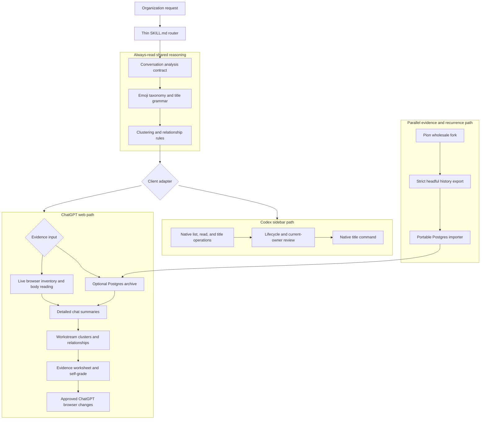

# Codex Thread Organizer Design

`codex-thread-organizer` is a Codex-only skill for making a large conversation
history usable. Its product is not an exporter or a status dashboard. Its
product is body-derived organization: recognizable titles, related workstream
groups, Project placement, and an honest view of what each conversation is
about.

The skill must work for both Codex sidebar threads and ChatGPT web chats. It
shares the reasoning that decides what a conversation means; it does not force
the two clients to share the same mutation or status model.

## Design Priorities

1. **Organize first.** A live-browser ChatGPT organization pass is usable before
   history synchronization exists. Export and Postgres improve evidence quality
   and recurrence, but never gate the core workflow.
2. **Read bodies before naming anything.** Titles, previews, timestamps, paths,
   and Projects are routing clues, not classification evidence.
3. **Make relationships visible.** A useful history shows which conversations
   continue, correct, supersede, duplicate, or relate to each other.
4. **Use emoji as semantic metadata.** Emoji identify domain or work type. They
   are not a substitute for a concrete title and, in ChatGPT mode, are not a
   completion/status system.
5. **Keep changes reviewable.** ChatGPT organization is proposal-first: inspect
   the evidence, grade the proposal, obtain approval, then use the mutation
   capability exposed by that client. Do not add a mandatory post-mutation
   read-back pass.

## System Shape

The `SKILL.md` router must name the shared references first, then choose exactly
one adapter. It must not contain the full workflow, the Postgres schema, or
Pion implementation instructions. Those belong in routed references and this
package documentation.

## Shared Conversation Reasoning

Every adapter produces the same analysis record before titles, Projects, or
relationships are proposed.

### Required conversation record

- Stable source ID and source kind.
- Current title, update time, and current Project when the client exposes one.
- Opening request and later scope changes or corrections.
- Detailed summary of the conversation's actual subject.
- Important decisions, delivered outcomes, named systems, repositories, PRs,
  issues, files, and artifacts.
- Concrete remaining question or action, when relevant to the requested pass.
- Candidate workstream, related conversation IDs, and relationship evidence.
- Candidate title, category emoji, Project placement, and confidence.

### Detailed summary contract

Workers assigned a cluster return detailed summaries. They do not return only
titles, a color, or a status symbol. Each summary must answer:

1. What did the user actually want?
2. What did the conversation accomplish or decide?
3. Which specific nouns distinguish it from adjacent conversations?
4. What artifacts or systems make it part of a workstream?
5. What remains uncertain, if anything?
6. Which other conversations have explicit evidence of a relationship?

For a larger pass, workers may review independent clusters in parallel. The
coordinator owns cross-cluster reconciliation and never treats a worker's title
as sufficient evidence by itself.

### Workstream and relationship rules

Use body-derived overlap in goal, implementation state, artifact, system,
decision, or explicit reference. Do not cluster solely because two chats share
a broad topic, working directory, date, or emoji.

| Relationship | Meaning |
| --- | --- |
| `continues` | A later conversation carries the same active work forward. |
| `supersedes` | A later result replaces the earlier operative result. |
| `duplicates` | The conversations cover materially the same request or outcome. |
| `corrects` | A later conversation fixes an earlier factual or implementation error. |
| `related` | The workstreams inform each other but remain distinct. |
| `independent` | Nearby in time or vocabulary but not the same workstream. |

## Codex Adapter

The Codex adapter preserves the existing native-thread contract.

- Inventory every accessible sidebar kind and report bounded coverage honestly.
- Read substantive task bodies before classification.
- Use lifecycle states and current-owner analysis only here:
  `done`, `active-remaining`, `continued-elsewhere`, and `parked-unclear`.
- Apply status and retention markers only when the evidence supports them.
- Rename only `title-mutable` native targets through the native title command.
- Retain the empirically verified 60 UTF-16 title ceiling for Codex targets.

Codex lifecycle markers are not shared classification metadata. They must not
silently leak into ChatGPT title proposals.

## ChatGPT Web Adapter

The ChatGPT adapter has two interchangeable evidence inputs.

### Live browser input: first usable path

- Use the actual ChatGPT history surface, including its lazy-loaded scroll
  container. Initial sidebar rendering is not a complete inventory.
- Open each selected chat and read enough of the actual body to meet the shared
  summary contract.
- Use this path for the first real 30-chat pass and whenever recent freshness
  matters more than broad historical coverage.
- Drive the browser only for approved ChatGPT renames and Project moves.

### Postgres archive input: optional enhancement

- Use the synchronized history for broad, repeated, or cross-device analysis.
- Treat ChatGPT as source of truth. Check live browser state before mutation.
- Never require the archive to exist before producing a live-browser proposal.
- Persist summaries, workstreams, relationships, proposals, grades, and applied
  changes so future passes can build on prior reasoning without treating the
  database as a control plane.

### Project and category rules

- Prefer an existing ChatGPT Project when a cluster clearly belongs there.
- Propose new Projects, Project consolidation, or ambiguous moves separately.
  Do not create a Project implicitly.
- Use title vocabulary and one to three category emoji to make related chats
  recognizable across Projects and in flat history.
- Keep ChatGPT titles concrete and short. The Codex 60-unit ceiling is a
  conservative style target, not a claim about ChatGPT's native limit.

### Emoji taxonomy

The shared taxonomy records each approved emoji's Unicode version, CLDR name,
semantic meaning, ambiguity warning, and example domains. It is the authority
for category use, including newly released emoji that a model may not know.

- Unicode Emoji 17 is the released baseline.
- Unicode Emoji 18 candidates live in a clearly labeled preview section.
- Do not apply preview emoji until the target client visibly renders them.
- Prefer a familiar, precise older emoji over a novel one that risks rendering
  as a missing glyph.
- Dispatch a focused emoji-research subagent when a requested category needs a
  2025/2026 emoji, a candidate is absent from the taxonomy, or rendering is
  uncertain. Its return must name the official Unicode version, CLDR short
  name, code point or sequence, semantic recommendation, ambiguity warning,
  and observed target-client rendering. The coordinator adds a verified result
  to the taxonomy before using it in a proposal.

Approved combination seeds from earlier organizer work:

| Combination | Semantic use |
| --- | --- |
| `🤖🧪` | Agent research, harnesses, and evaluations. |
| `☁️🖥️` | Cloud compute, GPU rental, and serving. |
| `🛰️🤖` | Robotics, sensing, and autonomy work. |
| `🛰️🔌` | Sensor power, network, and bring-up work. |
| `🏠💧` | Home and irrigation systems. |
| `💾💸` | Storage hardware and pricing research. |
| `🧭🏗️` | Architecture direction and system design. |
| `🎨🏭` | Generative-media production systems. |

These are categories, not completion markers. Avoid `✅`, `🟡`, `🔴`, `⏸️`, and
`🚧` in ChatGPT titles unless the user explicitly asks for a status-oriented
view.

## Proposal, Evidence Worksheet, and Self-Grade

No ChatGPT chat changes merely because a first title idea sounds good. Every
proposal pass produces a concise, reviewable worksheet instead of private
reasoning traces.

### Evidence worksheet

For every selected chat, show:

| Field | Required content |
| --- | --- |
| Chat | Current title, stable ID, update time, and current Project. |
| Summary | Body-derived subject, outcome, and distinguishing nouns. |
| Workstream | Proposed cluster plus the concrete basis for membership. |
| Relationships | Related chat IDs, relationship type, and evidence. |
| Proposed title | Old title, new title, and emoji meaning. |
| Project action | Keep, move to an existing Project, or propose a new Project. |
| Confidence | High, medium, or low, with the uncertainty named. |
| Actionability | Apply after approval, defer for review, or leave unchanged. |

At the cluster level, show the cluster name, member chats, canonical Project,
shared evidence, collisions with nearby clusters, and any proposal that needs a
user decision.

### Self-grade rubric

Grade each chat and each workstream before asking for approval.

| Dimension | Pass condition | Failure treatment |
| --- | --- | --- |
| Body coverage | The actual body was read sufficiently to identify request, outcome, and distinguishing content. | Do not rename or move it. |
| Summary fidelity | Summary matches the body and does not replace evidence with a guess. | Rewrite or mark uncertain. |
| Cluster coherence | Shared goal or artifact is stronger than superficial vocabulary overlap. | Split or leave independent. |
| Relationship evidence | A named or concrete link supports the relation. | Downgrade to `related` or remove it. |
| Title specificity | Title distinguishes the chat without reopening it. | Rewrite; generic nouns and marker-only titles fail. |
| Emoji fit | Every emoji contributes a documented category meaning. | Remove decorative or redundant emoji. |
| Project fit | Existing Project is a clear home and does not erase a distinct workstream. | Keep current Project or propose separately. |
| Mutation safety | The selected client exposes the needed mutation capability and the target is still eligible. | Skip mutation. |

Only high-confidence, passing entries are eligible for an approved mutation.
Medium-confidence entries remain proposals. Low-confidence or unreadable chats
remain unchanged and are reported as such.

### Approval and application

1. Present the worksheet, grouped proposals, and grade summary.
2. Revise failed rows before requesting approval.
3. Receive approval for the selected title and Project changes.
4. Apply the approved operation through the client's exposed mutation path:
   native command for Codex, browser controls for ChatGPT.
5. Record the command or browser-operation result as applied, skipped, failed,
   or concurrently changed. Do not reopen chats merely to verify a mutation.

## Pion and Postgres Boundary

The Pion fork is the history-acquisition component. It remains a wholesale MIT
fork with its upstream remote and existing export behavior retained.

- Pion obtains normal history, Project history, full conversation detail, and
  branches through its existing modules.
- The fork adds only strict synchronization behavior, a run-scoped browser
  command, terminal events, a temporary transport payload, and the portable
  importer.
- The importer normalizes current conversation graphs into the dedicated
  `chatgpt_history` PostgreSQL database on `pg18-core`.
- It stores conversation metadata, Projects, membership, messages, branch
  edges, visible text, hashes, sync status, summaries, relationships, and
  proposals.
- It does not retain ZIP collections, downloaded attachments, attachment
  binaries, or raw-export archives. The run payload is deleted after a
  successful import.
- A daily user-session due-check runs on each configured workstation. PostgreSQL
  coordination allows one active headful browser to perform the 72-hour sync;
  other workstations safely no-op.

This path improves completeness and makes repeated analysis inexpensive. It
does not decide titles, categories, Projects, or relationships.

## Plugin Boundary

This is already a dedicated Codex plugin package. It is distributed only to the
Codex consumer and currently contains:

- `.codex-plugin/plugin.json` for package metadata and discovery.
- `skills/codex-thread-organizer/SKILL.md` as the agent-facing router.
- `agents/openai.yaml` and trigger evaluations for Codex discovery.
- Routed references for the shared model and client adapters.
- This README as human-facing design documentation; it is not automatically
  loaded as skill instructions.

The package currently has no executable scripts. That is intentional:

- The Pion fork owns exporter, headful browser runner, temporary payload, and
  Postgres importer code.
- `coldaine-homelab` owns the Postgres database, roles, TLS, and network policy.
- The plugin owns only the reusable organization instructions and prompt-level
  subagent contracts. It must not embed a second exporter or daemon.

## Delivery Order and Acceptance Gates

### First: the skill itself

1. Replace the current monolithic skill body with a thin router and shared plus
   adapter references.
2. Add the live-browser ChatGPT adapter, evidence worksheet, and self-grade.
3. Run a real proposal-first pass for the 30 most recent ChatGPT chats.
4. Apply only user-approved changes and read them back.

This is the first product gate. A built exporter or database is not evidence
that the skill has been delivered.

### Parallel: durable evidence

1. Fork `pionxzh/chatgpt-exporter` into `Coldaine/chatgpt-exporter` and retain
   upstream provenance.
2. Provision the dedicated Postgres database, least-privilege roles, TLS path,
   and private network policy in `coldaine-homelab`.
3. Add strict headful synchronization and the normalized importer to the fork.
4. Connect the ChatGPT adapter to the archive as an optional evidence input.

### Complete only when

- The skill has generated a detailed, graded proposal for 30 real recent
  ChatGPT chats through the live-browser path.
- Approved title and Project changes have been attempted through the appropriate
  client mutation capability.
- Codex lifecycle behavior still works and remains isolated to Codex mode.
- A portable headful workstation has completed an idempotent Postgres sync.
- A later sync updates changed chats without duplicate records and another
  workstation safely yields to the database lease.
