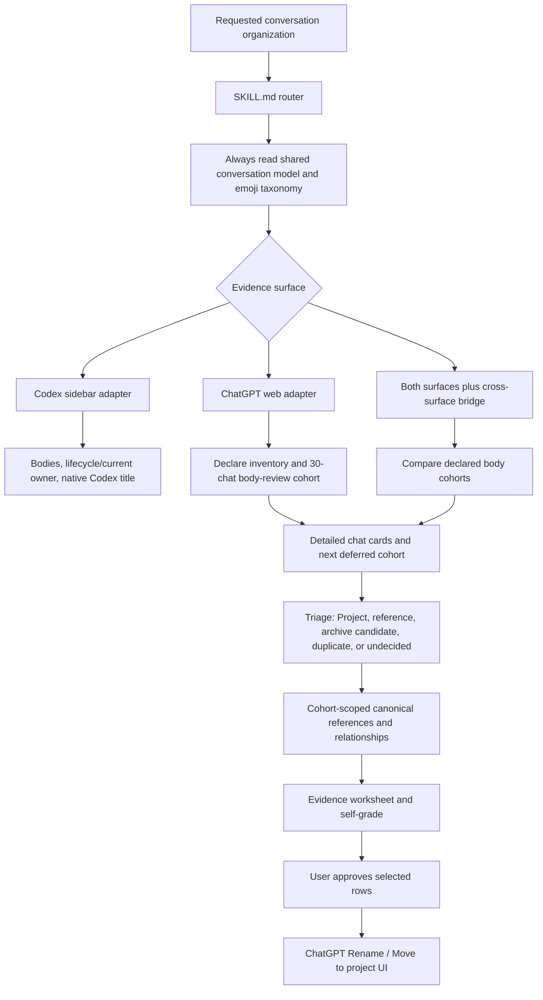

# Codex Thread Organizer

This is a Codex-only package that organizes both Codex sidebar tasks and
authenticated ChatGPT web conversations. `SKILL.md` is deliberately a thin
router; this README is human-facing package documentation and is not loaded as
skill instructions.

## What it changes

- Codex keeps its native lifecycle-aware title system, status markers, current
  owner reasoning, and verified title limit.
- ChatGPT web gains body-derived summaries, workstream grouping, cross-chat
  relationships, semantic emoji titles, and existing-Project-first proposals.
- Large ChatGPT histories are reviewed in declared cohorts of at most 30 chats.
  Inventory chooses candidates but cannot classify or mutate them; every pass
  records the next deferred cohort.
- A canonical reference is canonical only within its declared reviewed cohort,
  never a claim about unreviewed history.
- A cross-surface bridge compares readable ChatGPT and Codex bodies. It uses
  shared work and artifacts, not a matching Project name or sidebar title.
- ChatGPT triage does not force every conversation into a Project: it separates
  project work, canonical and standalone references, archive candidates,
  duplicates, and unresolved human choices.
- New Projects and Project merges are separately evidenced and approved; a merge
  is an explicit set of approved moves, not an assumed UI feature.
- ChatGPT changes are proposed with evidence and a self-grade before the user
  approves individual browser renames or Project moves.
- ChatGPT does not receive Codex completion or status markers by default.

## Flow

## ChatGPT proposal contract

Each proposed change identifies the scope, current title and Project, a detailed
body-derived summary, relationship evidence, disposition, proposed title with
one to three meaningful emoji, and Project action. When Codex work is in scope
it also carries the body-evidenced bridge result. The self-grade rejects vague
titles, title-only inference, unsupported cross-chat or cross-surface claims,
status-marker leakage from Codex, Projects used as a catch-all, and new Projects
proposed without considering existing ones.

The skill currently reads live browser history. A future archival/sync runtime
may supply durable bodies, but it is deliberately outside this package and does
not block the live ChatGPT organization flow.
